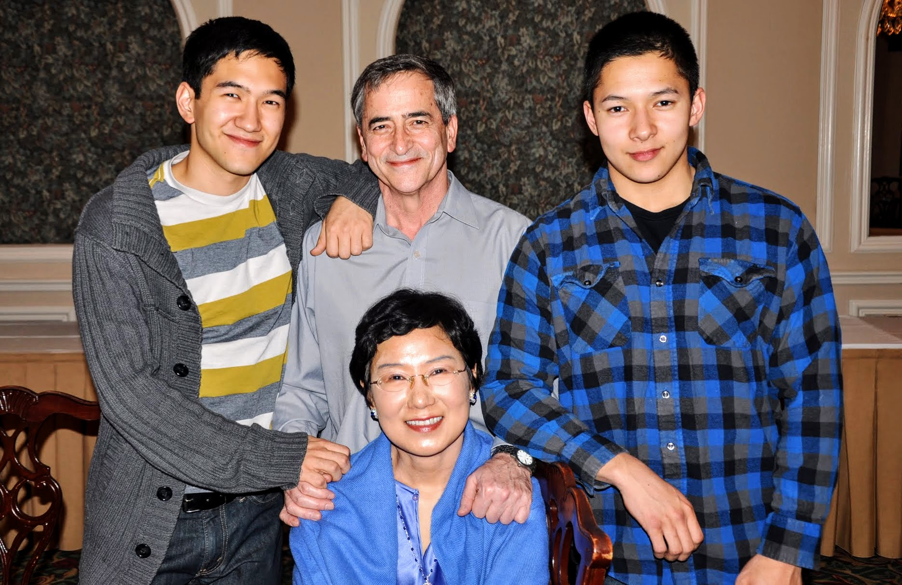

# Optimism Revisited

sunriseeast — 09–14–2011

I feel like an ex-con who couldn’t stay out of trouble in a polite civilian society.

My cancer came back after short three months of remission. It was confirmed last week. I had a suspicion from mid August, so when the routine follow-up scan results came back positive, I was disappointed, but not surprised. I was already mentally prepared to deal with these results, and had a list of questions to ask the doctor right then and there. In fact, if the routine scan was not scheduled right around the corner, I would have asked for one.

I knew all along that the odds are near 100% that I would recur within a few years, but I was hoping for a longer remission. Obviously, this is quite disappointing — a hard pill to swallow. What really surprised me was not that it recurred so soon after I got into remission, but how fast it happened. Early August, all the test results were clean. I felt great with everything in perfect order. By mid August, I already knew that something was off. Usually, when women recur, the cancer blood marker starts to rise and it takes several months before anything shows up on the scan. My cancer moved from zero to 100 miles/hour in at most 3 weeks to show scattered tumors in the abdominal and pelvic areas. I am a Type A personality overachiever. So is my cancer. We are well matched.

A case like mine is particularly troublesome since it recurred so fast and so soon after the initial remission. On the book, this worsens my prognosis considerably. The initial diagnosis and suboptimal surgery results already earned me a place in the high risk group. With this recurrence, now my membership has been upgraded to the “elite” status. If there were a certification process for clinical depression, I would pass it with flying colors with this recurrence. I have done everything right on the book — nutrition, exercise, supplements, etc. So what else can I do? I used up all the arsenals in my armory. There is no more arrow left in my quiver. No magic bullet that I can dispense. Perhaps cancer has already won, not only the individual battles, but the whole war that will end all other wars.

And yet, after a few days of whirlwind of activities — doctor’s visit, scans, and blood works, plus my thoughts all over the place, I am actually serene and yes, dare I even say “optimistic”. I am in an oddly calm and uplifting and uplifted mood. I feel that there is still so much I can do, and so much more to try. I must say, though, my definition of optimism has undergone a slight revision. The target of optimism no longer includes ONLY a long life: it now has other subtle nuances. Such as grace, dignity, and an ability to reconstruct bits of potentially harsh reality into something affirmative, not only for myself, but for those around me. I am optimistic that I can achieve all that.

Yes, realistically enough, what’s in store for me may not be what I had hoped for. But I am optimistic even there because no matter what happens, I will know that I did my best and I did it with dignity and grace. I can look at my recurrence as a calamity or as an improvement to the original game plan. I was not even supposed to go into remission when I did: my starting point was very grim, and the expectation was, it will take much more than the standard length treatment to put me in remission. So, I choose to look at my current situation as the original scenario plus an unexpected vacation and respite in the middle of what was supposed to be a long treatment anyway.

So, round 1, Me: 1, Cancer 0. Round 2: Me: 0, Cancer 1. So we are even now. Now we are starting the third round, and I believe realistically there will be more rounds, hopefully. As long as I don’t get carried out of ring completely KO’ed, I will continue this match as long as it makes sense. And, call me a fool, I have a very good feeling that I will win the round 3. I don’t think I have a KO punch for my opponent that will end the match with me as an undisputed winner. But, that’s not the only way to win the match. All I need is just one more round of victory than my opponent. That, I think I can do. You can call me an incorrigible optimist, but I dare say, I am a rational optimist. Today, at my doctor’s office, I asked him about my prognosis. I said, “you know, I have a lot of bridges to burn and I don’t want to start burning them too soon!” He said, it all depends on how I respond to the next line of therapy. So, onward, comrades!

Another thing that has undergone somewhat of a change is my attitude toward the whole philosophy of delay of gratification. I used to consider my principled discipline for delay of gratification for now for something better in the future to be the foremost virtue that I possess. In fact, I managed to brainwash my kids into internalizing that value. Well, I am in a mood to allow myself to be a bit more “live here and now” and not sacrifice 100% of what’s pleasurable for the future goal. I may even buy clothes that are not on sale. I used to wait for 70–80% discount, not because of money per se, but out of principle. Even so, I am still planning for a major professional move that will take several years of hard work to reach the next stage. The plan of record is still the same though I may have to delay the onset of the execution depending on how I do with the new treatment.

When I had my suspicion of recurrence confirmed, the first thing that came to me was the sense of gratitude. Gratitude because,

* It’s me, not my husband or kids.

* It’s happening now, not a few years ago when my kids were still sorting their own adolescence issues

* I have my loving family and friends around me.

* I am still so otherwise healthy and vital that I can deal with punishing chemo or whatever they have to dish out to me.

* I have the presence of mind to cope with what could be unendingly grim news.

* I have access to the very best medical facilities, many of them, all within 40 miles of distance.

* I have the resources to allow me to navigate through a lot of issues

* I did not go for the professional opportunity that would have been mine a few months back — it was a dream job with glamour galore, but I had a good sense of not taking it because it would put me on the road three weeks out of a month all over the world.

Last, not but the least, I am very grateful that I was offered an opportunity to participate in a new trial at MSKCC (Memorial Sloan Kettering Cancer Center). Perhaps some of you remember that I was participating in a vaccine trial for high risk women in their first remission at MSKCC. Well, I flamboyantly flunked out of this trial by inconsiderately recurring so soon. Yet, Dr. S. who is in charge of that failed trial, offered to put me on a new trial for women who recurred very soon after the initial remission. Not only he is a young and handsome dude, he has a good heart!

This is a major break for me. The trial involves a drug called Doxil plus an experimental drug that enhances body’s immune functions. Doxil is the best treatment option for women like me. The problem is, Doxil is not to be had anywhere in USA presently due to the scandalous cancer drug shortage situation, and there is no indication when it will be available again: rumor has it, not until next spring! It turns out MSKCC has ONE full treatment dose of Doxil left for the last trial patient, and Dr. S offered it to me. I consulted with several doctors, including my primary gynecologic oncologist who diagnosed me, operated on me, and saw me through the front line chemotherapy, and all of them told me to jump right in with both feet if anyone is offering Doxil to me.

I really need to succeed in this second trial. If I fail again, I am afraid I will be known as a kiss of death at MSKCC — the patient who ruins all of their clinical trials — and will be blacklisted! Humor aside, I really lucked out with this Doxil trial. I start the first treatment next Monday. It’s a very arduous trial with very time consuming commitment. I will be spending a lot of days in NYC. During some of these days, I will be jailed in their chemo suite for close to 10 hours during which time they will draw my blood every other hour after they administer the drugs. This is because I am a trial subject, and they need my blood for research purposes. I will have a legion of vampires. These days, everybody is after my blood, literally! I can’t count how many times I have been poked just past few days to confirm my recurrence and to prep me for the new trial.

Somehow, in the midst of all this, I feel that I am being taken care of by more than the usual suspects of doctors, friends, and family members. I fell into the abyss again, but I see a rope being thrown at me to climb my way out by. I feel surrounded by energy that infuses me with a sense of hope and optimism that is so incongruent with the objective assessment of my current situation. I thought of it as a survival instinct — that is, my mind knows that in order to survive through this, I need a sense of hope, a positive outlook, so that it instinctively infused my conscious mind with this optimism and clearheaded calmness to make all the necessary decision unclouded by negative emotions. Is it really that simple though? Perhaps there is something more to this. If I were a religious person, I would call it God’s grace. If I were a new age spiritualist, I would call it a guiding spirit. I were a shamanist, I would call it a spirit of ancestors. I don’t know what it is or where it came from, but I can visualize it.

I am standing in a room. My opponent donned a flash costume of nails and spikes all over. It is putting on a scary show of shock and awe with all the appropriate sound and light special effects spreading doom and gloom. I see a little girl in the corner. She reaches out to me saying “I may look frail, but I am much stronger than that. Don’t give up on me, because I won’t fail you”. She offers her hand, and I take it. Together we stand. I don’t know what to call her, or who she is. But I am comforted by her presence. Somehow, I am not afraid anymore. Together, we take one step forward hand in hand ……

=========================

sunriseeast — 09–15–2011 05:06 PM

*“My dad had chemo all his 7 years of fighting Cancer, I can understand what you have to go thru to do your treatments. My thoughts are with you.*

*I am sure you have made financial arrangements to your assets, keep it written down clearly, including your investment objectives. When I became my mom’s POA, her stuff was so tangled that it took me almost a year to catch up without her help.”*

Since I am reminded of my ensuing mortality so deftly, I would like to also share my long term plan that goes way beyond the usual laundry list of finances and such.

Being a consummate long range planner, when it is appropriate, I will designate three of my friends as a committee co-chairs to get a new wife for my husband.

Just to be sure, I will also be creating a dating profile for him on an on line site for 50+ singles. What better recommendation letter than a heartfelt endorsement from a dying wife? I could say something like, I tried him for ~30 years, and trust me they don’t get any better than this. What do they use as a euphemism for used car? Pre-owned, right? Yeah, I will give him the best certificate as a previous owner.

There is a caveat though. The new wife will NOT have any more closet space than what I had, and she will not get any of my jewelry — that’s for my son’s kids.

=========================

sunriseeast — 09–15–2011 09:58 PM

this is all hilarious!!! Thanks for the good laugh.

Fortunately :) I don’t have any unattached girl friends. All of my female friends are happily married. So, it’s good that I don’t have to second guess anybody’s intention.

Meanwhile, the plan of record is still for me to continue to be a pain in the butt for my husband for a long time.

