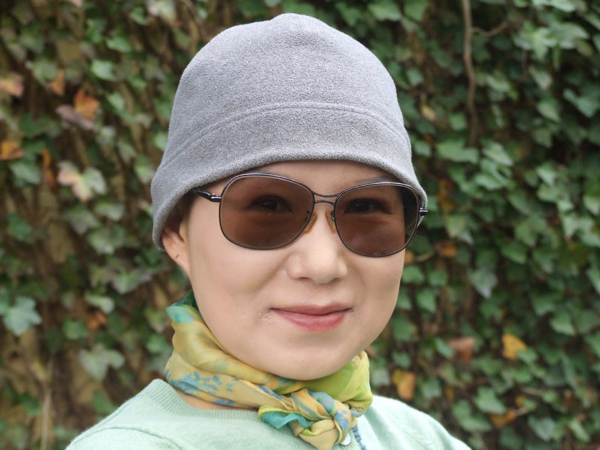

# The Anatomy of Optimism

# July 17, 2011

When my hair started to fall out, I had my husband shave it to half an inch from the scalp. Interestingly enough, some strands kept on growing through the chemo treatment phase while others were falling out. Among those that grew a couple of inches, a few of them were grey. One evening, my husband caught me standing in front of the bathroom mirror and pulling these few, pitiful grey hair from my mostly bald head. He started to laugh hysterically. I turned around, and said “Don’t laugh. It’s this kind of unhinged optimism that will let me outlive you”. Now that I think about it, I have to admit the scene must have seen quite comical.

One of the common marching orders cancer patients get from friends and relatives is to be positive and optimistic. I know they all mean well, but this actually is quite annoying. What, now, on top of everything else we need to deal with, we have another action item to follow up on? That we can just will ourselves to be positive and optimistic? Positive for what, for whom, and how? Furthermore, even if you can manufacture an optimistic attitude on demand (there are ways to do it, some legal, some not), precisely what does it really mean and how does it do its magic? You become positive and optimistic, and poof, a miracle happens and you have a spontaneous remission? Just like that?

I am a bit sarcastic here. In support groups, cancer patients routinely show support for each other by saying “I am sending positive thoughts to you”. Of course, a positive outlook helps. Some researchers are starting to discover that there is an actual neuroimmunological ground to support a hypothesis that minimizing stress has a positive effect on cancer management. So to the degree that optimism keeps anxiety and fear at bay, and thus lowers the stress level, it may provide a bit better prognosis for the patient. Some people believe positive energy unleashed by optimism will have an impact on their prognosis in and of itself. I will allow this also — to a degree. Who knows, maybe there is indeed something called universal energy, and one needs to harness it through positive thinking. I am not a subscriber of such a belief, but many are, and I don’t feel I have the final say over whose belief is correct.

I suspect, though, the role of optimism and positive thinking alone, in isolation of actions that accompany them, is rather limited. I believe optimism must be earned, justified, and rationalized. If it is not grounded on facts and followed by actions, it is at best wishful thinking and at worst delusion. If a lung cancer patient is so optimistic and positive about her survival odds that she continues to smoke a pack a day, what would be the consequence of her positive thinking? I am a big believer of optimism and positive thinking because of what it may encourage the patient to “do”. It may give her a sense of control over the future course of events, which in turn motivates her to gather information on what needs to be done and do it. It may enable her to make a rational decision on her treatment course without fear induced intellectual incapacitation.

Among patients facing life threatening medical conditions with a very poor prognosis, you can find two extreme groups. One group, I will call them an ostrich, do not want to know much about the disease. It is too scary and threatening. It overwhelms them and challenges their sanity. I certainly understand this sentiment. Right after the surgery, I spent about a week being an ostrich with my head buried in the sand deep. Couldn’t even look at my scar, let alone going online and doing all the research on post op issues and treatment plans. Didn’t open my email in fear of reading something from well meaning people asking me how I was doing, because that would mean something happened to me. I wanted to pretend nothing really happened. It is so ironic. Since this whole affair started, that was most improbable time to fake “normalcy”. With a fresh, unhealed incision scar of 14 inches, I barely managed to walk around the house, hunched over with one hand over my abdominal area.

In the end, I realized that I had to pull my head out of the sand: I was starting to suffocate there without any insight, data, knowledge, and, most importantly, a plan of action — a project management template. So, I decided to be a giraffe instead, sticking my neck out to survey the landscape as far out as possible. In fact, I developed genetic mutation to add several feet to my neck — I am a giraffe with the longest neck in the recorded annals of great giraffes…. I am an avid, some may say morbid, consumer of all the mortality statistics for my diagnosis. I meticulously collect them and analyze them with a cold passion and a macabre precision of an actuary. No, this is not a form of self flagellation, though this is a sin I have been often accused of — for other things. Nor is this a twisted attempt to exaggeratedly advertise the severity of my condition to garner maximum sympathy from others. Instead, it’s a matter of sizing up my adversary.

“Who are you?”

“Are you as scary as they all think you are? Or are you bluffing?”

“Though you pretend otherwise, surely you must have weaknesses. What are they?”

“If I can’t beat you, can we at least sign a treaty for peaceful coexistence?”

I read enough statistics that put my five year survival odds at low single digit numbers given the initial diagnosis and suboptimal surgery results. Discovered at my stage, my cancer is not supposed to be curable, and even if a patient manages to get into remission after the initial surgery and chemo treatment, a recurrence within a couple of years is a near certainty.

“O.K. I got you. You really are a scary monster. You have armor with spikes sticking out all over. Your face mask is a work of art and truly awe inspiring in its ability to induce a catatonic mental state among your foes. Like Medusa. I am sure you won many a battle with a sheer terror you can induce without actually charging forward toward your adversary. BUT…. Are you really that scary for sure? Beneath that seemingly impenetrable armor, is your flesh hard as a nail? What lies beneath that Medusa face mask of yours? “

As someone with a Ph.D. level training in statistics, numbers do not impress me in and of themselves, unless I have every reason to believe that they are indeed legitimately generated and reflect my profile well. When I saw the published stats, I decided to learn how they were compiled, who the “average” patients were, and what kind of care these “average” women get. What I discovered was that these statistics were very poorly constructed with an egregiously unrepresentative sample with many methodological flaws. And, I came to a conclusion that with a perfect health other than the advanced cancer, diagnosed at a “young” age of 51, with ample resources and access to the very best care, I am already at the far right side of the statistical distribution curve — an extreme outlier. Furthermore, survival statistics are by nature a retrospective affair. The numbers we see now reflect how the women diagnosed 10–15 years ago fared. The only way these odds apply to women recently diagnosed is if we assume that no advancement has been made during last couple of decades, and none will be made next 10 years or so either. As much as I am impatient with the lack of a rapid progress in the field, I emphatically disagree with this statement. By the time I reached this phase of my research, I already upped my own personal survival odds ten folds.

“You are not as scary as you present yourself to be. That Medusa face of yours is a poor replica of the real thing. Now, let me see if there are weaknesses that even you are not aware of.”

When I started to do research on treatment options, it became clear that surgery and chemotherapy are only part of the equation, and the western mainstream medicine’s obsession with the cut, poison, and burn approach for cancer management left the whole field of potential advancements unexplored. It’s the whole body approach — the role of nutrition, diet, exercise and the mind-body connection. I am convinced the next breakthrough will come from this unexplored territory. So what is my winning strategy for striking gold? Not by scraping the bottom of the mine already picked clean. But by exploring a new mine down the road. There, I intend to find the mother lode. I researched on all things that might prepare my body to protect itself better, keep cancer at bay longer, and keep me healthier — things that will let me be the long terms survivor. So, for my tenacity to keep on learning about more ways to handle my cancer better and the discipline to do whatever is necessary, I am again doubling my odds of survival. Twelve servings of cancer fighting vegetables? Check. I will up it to 15 servings. Daily exercise of 30 minutes? Check. I will do one better — 75 minutes. Good support network? Check — I am giving more than I take — the best way to nurture a support network.

“Now, I found your weakness. You are not omnipotent. You can be defeated. I must say the odds are still in your favor. But perpetual conflict is exhausting for both of us. We don’t have to talk about outright surrender either way. Can we perhaps coexist? What are your terms?”

The word “cancer” evokes a very powerful emotional reaction. Though the survival odds in general have improved significantly last 20 years or so, most patients with a very advanced diagnosis do not escape the doom and gloom once they realize that the word “cure” does not apply to their case. However, the more I learn about cancer — its symptoms, treatment options, and prognosis, I realize that cancer has an undeserved bad reputation. I believe that the fear of cancer, even the advanced type, is greatly exaggerated. Cancer is far kinder to life than a lot of other debilitating diseases. Even an incurable cancer like mine is a disease that lets you live a relatively and, in many cases, completely, normal life in between bouts of treatments that may be spaced months at the minimum or many years if one is lucky. Even if a cure is not possible, decades long remission is.

I will take cancer any day over a chronic heart disease that does not let you climb Mt. Kilimanjaro, or MS that gradually incapacitates you, or a kidney disease that requires dialysis and does not allow you to leave town. Cancer can be maintained like a chronic disease. In any oncology wing, there are patients who have been on some form of chemo for close to 20 years, with a relatively good quality of life — attending their kids’ graduation ceremonies and weddings. You do not need to be necessarily cured to have a good quality of life for a long time. You do not necessarily need to have the survival odds of 90% NOW to be hopeful for the future. You need to hang around just long enough each time for the next breakthrough. I remember reading an article about a woman with a breast cancer who got only a few months to live. She lived a bit longer than that — just long enough to become the first patient in her state to receive the latest experimental drug, which turned out later to be the breakthrough treatment for women like her.

“I agree you are a formidable adversary. Actually, I do not loathe you. You took away certain things, but you also gave me a lot back. Let’s co-exist. I will let you have your moments once in awhile. You let me live my life peacefully in between. In the end, you may even find that it works out better for you to stay at peace with me indefinitely!”

I am very optimistic for my future prospect. I believe I can beat the odds with the widest margin and emerge as an extreme statistical outlier. After all, I have already beaten the odds — I managed to go into remission after a standard treatment against heavy odds. I worked very hard to develop this optimism — I had to become the giraffe with the longest neck to survey the land and find a greener pasture far over the horizon that is not a mirage or a product of a hallucination. It is optimism based on facts and reason, not denial, wishful thinking, and ignorance. It is optimism of a giraffe, not an ostrich. Most importantly, it is optimism which I endeavor tirelessly to justify, rationalize, and back up. And, I intend to do that indefinitely. To me, optimism is not a blind faith that one day a knight in shining armor will come along and sweep me off the feet. Rather, it is a conviction that there is indeed an accursed prince to be freed, and dogged determination to kiss as many frogs, toads, and for that matter any four legged amphibian creatures shorter than a foot (not even an optimist should tempt fate by trying to kiss an alligator), until my lips are covered with blisters. This is the anatomy of my optimism — the willingness to do thousand things that will each increase my odds by 0.1% at a time.

I cringe when some well meaning people, upon learning about what I went through and what I am dealing with, casually “order” me to be positive. I am zealously protective of my special brand of optimism and would rather not see it trivialized and cheapened by some Hallmark style single line catch phrase. For those with a compulsion to induce positive thinking on others, I have a suggestion. Instead of ordering the patient to be positive, do something that will make her feel positive. Show her how the published stats are outdated and her actual prognosis is much better. Take her out to lunch and make her laugh. Share an article about effective new treatment options that are being developed. Show how you care, not just in words, but in your action and deeds.

