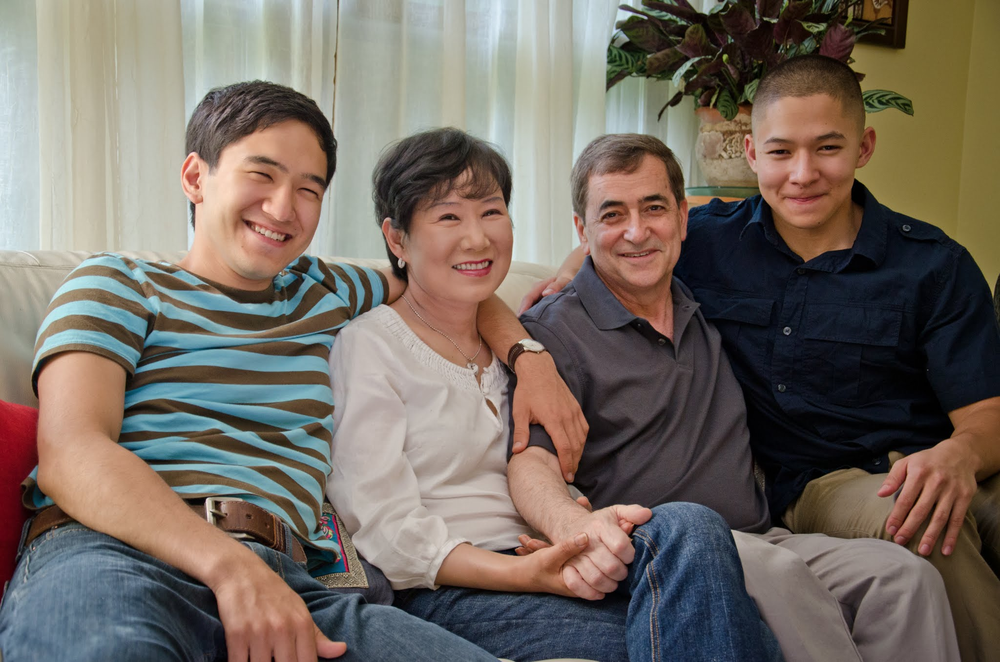

# So, the Journey Starts

Monday, December 6, 2010

Last several days were a whirlwind. On Nov 30, I went to see a primary care physician with some symptoms that have been bothering me last six weeks. A pelvic exam in the office showed something. That necessitated a visit with a gynecologist, who in turn wasted no time in setting up an emergency appointment with a gynecologic oncologist. Meanwhile, this morning the biopsy taken from the gynecologist’s office came back positive for cancer, and the ultrasound scan and CT scan show a lot of things all over the abdominal cavity, including things showing up in the liver. This puts the cancer at stage 4, and there is no stage 5.The best bet is ovarian cancer.

All this is new to me. I have been looked upon as a symbol of good health and youth. I’m 5'6'’ tall weigh 120 pounds, am fit and active with no grey hair. At age 51, most people thought I was barely 35. I had my regular check up religiously. Last gynecological check up was in April 2010. I never had health problem. I don’t even have mild headaches or indigestion problems. No symptoms whatsoever until about six weeks ago when I started to be a bit short on breath and feel full around my mid section. Never occurred to me that it might be cancer — none of these was severe. From that to this in just about 4–5 days. I have a lot to get used to. I will see my oncologist for the first time on Wed.

The first thing I did when I suspected what it might be was a Google search on survival statistics. On the surface, it looks grim (below 20% for 5 year survival). However, I am a statistician. I know how the numbers are generated. This number is based on aggregate total population of women, which includes much older women, women in ill health to begin with, women without a good support network and/or financial resources, women who don’t have access to the top notch medical facilities and experts, women who are not as disciplined as I am to do everything right in terms of healthy choices and lifestyle habits, and women who do not have the mental resources (both intellectual and attitudinal) that I have. Besides, these stats are, by necessity, outdated based on women who were diagnosed at least 10 years ago or so. A lot of breakthroughs happened since then. As such, I believe the statistical curve that generated the 5 year survival rate is NOT the curve that applies to me. I believe I have a very rational ground to predict that I will be on the far right side of the curve — an outlier.

The next thing I did was to compile the list of things I am grateful for. Not the “I had wonderful life and great family” line of deathbed declaration. That is several decade premature. But more mundane and practical things.

First of all, I am profoundly relieved that it’s me in this family that is going through something like this. It would devastate me to see any of my kids in this situation. I don’t think I can take it if my husband has to go through this. Among all the members in this family, I believe I am the one who can handle this with more grit and perseverance. So, even with all of this happening, I have a lot to be grateful for.

Second, I am grateful that both kids are now fully developed individuals. All the important things I should do as a parent has been more or less completed. Helping them form a healthy view of themselves. Giving them a solid foundation for sound values and moral judgment. Establishing a solid and healthy emotional landscape they can take with them no matter where their life journey takes them. Even if both my husband and I would disappear, an emotional, moral, and intellectual foundation has already been laid out solidly. If worse comes worst, and I were not around, they would be sad, but they would move on as healthy and well adjusted adults. I am genuinely grateful for that.

On a more micro level, I am definitely grateful for the fact that this did not occur two years ago: I would not have been able to help Jon go through the process of getting an amazing full ride scholarship in one of the top colleges in the country — the kind of scholarship process that takes a very long time to build up and requires a lot of strategizing to do.

I am also grateful that it did not happen three years ago when Daniel was still going to high school at home: I am glad that he had a great, carefree finale to the wonderful adolescent high school years. He is on such a good path now at a college that is perfect for him.

Third, I am so grateful for my unbelievably supportive husband. I can’t possibly choose a better person to support me through the most difficult challenge I am facing in my life. For last 25 years, he has always been there for me. He is my best friend, lover, and partner in life.

The list goes on. I can put together a list of all the mundane things I am blessed with that will let me beat the published stats, starting with an otherwise perfect health and all the way to one hell of an ironclad health insurance policy we have.

In short, even with this disease, I have been dealt a winning hand, and I am profoundly grateful for that. And, this lifts my spirit. 
That said, as a statistician, I can’t ignore the possibility that I may end up falling on the opposite end of the curve. So, then, what happens? The most important thing in this scenario is the legacy I leave behind. I need to leave something positive, something that will help my husband and two kids move on with a sad, perhaps, but uplifting view of who I was and what they meant to me. Perhaps, it’s a delusion of grandeur, but I feel that I have a singular power to control this. I do not have an absolute control over what happens to me, but I do have an absolute control over how I deal with them. How I metabolize them. How I react to them. I will not relinquish this control.

From this moment on, how I conduct myself each moment, each day will be written in a book that will remain with my family long after I am gone. I don’t have all the answers yet on exactly how best to write this book — I am just learning to orient myself in this long journey (I hope “long”). What is clear already though is, I need to think way beyond myself. I need to be honest and earnest. I need to get out of the mindset that this is all about me, because it is not. It’s more about them, and that’s what I should aim for.

