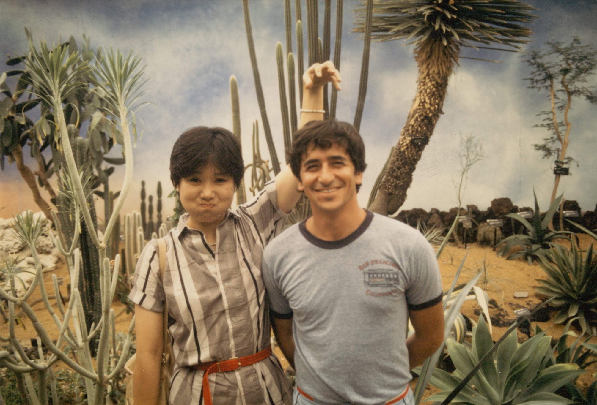

# A Beginning of a Journey: A Promise to Keep

December 2010

I picked up Amir, my husband, in the train station this evening. I told him about the CT scan that showed extensive metastasis all over the abdominal/pelvic area, including the liver. The biopsy results yesterday confirmed it is cancer. The results of the scan put it at Stage 4. I don’t need a doctor to tell me that there is no Stage 5; I have done enough research during the last couple of days to correctly guess what it is I am dealing with.

I thought I had processed most of my raw emotion during the day. I rehearsed over and over again in my head how I would calmly describe what I had learned, and reassure Amir that in spite of the scary labels and statistics, I would emerge a winner — whatever that means. I thought I would be more composed by the time I picked him up. I was wrong.

I cried all the way home, and we parked the car on the street for a while — I needed to compose myself in case Jon sees me in the family room when I walk in through the garage. I am keeping this quiet from the kids for now. Daniel comes home from college on Saturday, and I plan to have a nice family dinner out first and then discuss this in the evening together as a family.

I don’t know the last time I cried so hard. It was not the dainty, romantic, and elegant sobs of a movie heroine. It was loud and painful. Almost primeval. It was not about my potential demise or fear of the disease. It was not even about me. I am not afraid of death for myself, not because I have nothing to live for, but because I believe death is easy on the dying. The pain is for those left behind. My crying was mostly about Amir. One promise I made him when we got married was that I would be by his side holding his hand when his time came, that I would give him that comfort. The thought of not fulfilling that promise is unbearable.

I remember vividly the summer we met, over 25 years ago. He had just gotten his Ph.D., and was ready to go back to his home country, Israel, by the end of the summer. He had a job lined up there, and a moving contract for his things. I had finished my 3rd year in the Ph.D. program. We were supposed to be a fling, nothing more serious, just something to fill the lazy summer days on an empty campus before he returned home for good, and I returned to Korea for a short visit. Even so, right from the beginning, I had an almost instinctual understanding that between the two of us, I should be the one to send him off, that I am constitutionally, emotionally, better equipped to be left behind. So, I suggested that he leave first, with me accompanying him to the airport so that he had somebody by his side when he departed. He did leave with me saying “bon voyage”. But he came back. Six month later, we were married in a courthouse in Champaign, Illinois. His friends back in Israel had a betting pool for how long this marriage would last; nobody bet more than two years. My family back in Korea thought the shining family flagship was no more, as a nice girl from a respectable family did not marry a foreigner.

Since then, together we have built a nice life with two terrific kids. Nevertheless, I have always been acutely aware that he gave up a lot to be with me. Unlike me, who couldn’t wait to escape from the country I was born and raised in, he never intended to become a wandering Jew. It has only been the last few years that I have no longer felt responsible for the fact that he was living far away from the people and the way of life he loved. Not that this resulted in any sense of indebtedness or propelled me to overcompensate by being ever more accommodating and obliging. If his friends had known that, on top of everything else, I had lacked the sense of decency to live up to the reputation of Asian women of my generation for being meek and obliging wives, they wouldn’t have bet even two years. I have never been an easy spouse to live with. If anybody were to ask the secret of our long marriage, I would freely admit that it’s mostly Amir’s accommodating nature. He has always been the textbook example of what a supportive spouse should be. Meanwhile, I am a wife from Mars. This sums it up: a husband from Venus and a wife from Mars.

If I were to build a case for myself as a spouse, I would say I am a person of some integrity. I am a loyal, dependable person, and I keep my word. I would like to deliver on the only promise I made — that I would outlive him; that he wouldn’t have to be the one left behind. I have always been so indestructibly healthy, and I was so sure that I would live to be 100 and beyond, it never occurred to me that I might default on my promise. More than anything it meant for my own prospects going forward, the grim statistics that gave me less than a 10% chance of five-year survival pained me for the injustice of it all for Amir, who may be cheated out of the one promise given to him in return for the heavy price he paid for our life together. He, as usual, was unbelievably gentle and supportive as I sobbed uncontrollably. He held me and comforted me.

After a while we walked through the door. Jon was watching TV, blissfully ignorant about all this. In five days, when he learns what is going on, there will be an entirely different reality for him. The veneer of normalcy is disorienting and precarious.

