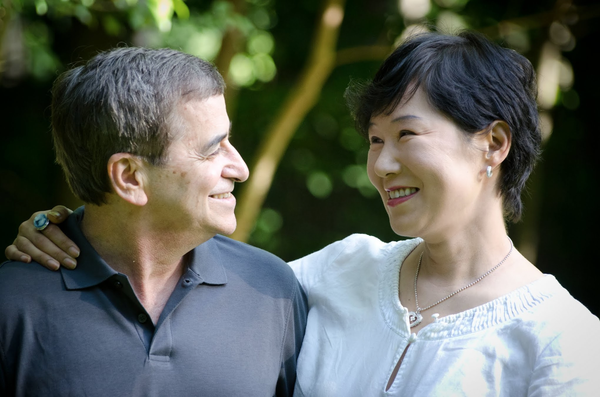

# A Choreographer And A Dancer

1/21/12

I got the scan results today. All clean. All the tumors and accumulation of cancer cells around colons like thick films disappeared. Some enlargement of couple of thoracic nodes, but they are way below the size that warrants clinical interests, and besides they have been like that for months. Dr. S believes that this is unrelated to cancer, and the radiologist only noted them so that it’s on record to see if later scans show any difference going forward. It looks like I am likely to go into remission. In fact, technically I am already in remission (a clean scan with a cancer antigen blood marker within a normal range). When and if I finally end this treatment successfully, I will have beaten 10 to 1 odds for complete remission following recurrence after such a short remission from the front line therapy.

I am relieved. I felt all along that the treatment was working based on my cancer-o-meter, and I knew I wouldn’t be surprised at all if the scan comes back clean. Still, it’s good to get this confirmation. That said, last couple of weeks, I spent an inordinate amount of time researching treatment options in case the scans show the disease progressed while on this treatment. Patients with my diagnosis succumb for two reasons — their body can no longer tolerate chemo or they no longer have chemo drugs that work for them, because a majority of patients eventually develop resistance to one chemo drug after another. If this new treatment did not work, this means, I am starting to exhaust usable options fairly early in the game — after all, I have been at it for only 14 months, and I was booted off of a clinical trial for recurrence because they believed that the treatment failed (though I more or less proved otherwise later — a moot point since trials have very strict rules and they do not take back the patients they booted off). Facing a foe charging forward with a full force and realizing that there are no more arrows in the quiver — this is the scenario I fear most. The name of the game is how to deploy a finite set of assets for maximum bang for the bucks as long as possible — long enough until new shipment arrives in the form of new breakthrough treatment options.

There is a sliver of hope here even for those who used up all of their arrows. Based on my research, it looks like there is a way to retrieve some of these arrows and used them again. I also realized that most oncologists are not very well versed in this black magic. This is a result of a perceptual block and a linear thinking on the part of the medical community, especially in the USA — where there has been a comparative dearth of access to different ways of practicing medicine. I am not talking about wildly the exotic alternative medicine that quacks and charlatans are hawking to desperate patients. I am talking about an out of the box thinking that is a bit different from the mainstream practice. I love Dr. S at Memorial Sloan Kettering Cancer Center (MSKCC), and I have a huge respect for his professional expertise. However, I don’t think he is infallible. Nobody is — as a premeditated lapsed Catholic (at the age of 7), I never accepted the infallibility of the Pope. I dare say I have been very good at what I do in my primary vocation but I have also been wrong many times. So, why should Dr. S be an exception? After all, it takes one naked emperor to spot another. Nobody is free of their own blind spots, and it takes a pair of outsider’s eyes to spot it. I intend to be that outsider for him. .

So, I went to the consultation with Dr. S today up in arms with a dossier of research papers of clinical trials conducted in Europe that have not made their way to the North American medical community for one reason or the other (mostly a profit motive, or lack thereof, of pharmacological companies). These were all about how to use the same drugs that appeared to have failed on a patient with a different delivery schedule and additional complementary drugs to produce a maximum, synergistic benefit. I was going to spring this on him if the scan results were bad. Well, no such dramatics. Instead of being a dignified, albeit tragic, heroine standing tall in the presence of her inquisitor, I behaved like a simpering teenager with dopey eyes muttering some incoherent nonsense — at least this is how I felt. O.K. He is a pretty handsome dude, but still for a 52 year old woman with a modicum of intelligence to behave like this is nothing to brag about. Well, between a tragic heroine at the stake, and a happy airhead, I will choose the later — for now, that is.

One thing I realized during last 14 months is, for recurrent advanced stage cancer like mine, treatment decisions are really more an art than science. Not all doctors are consummate artists. Or, should I say, a choreographer with a nuanced appreciation of his main performers and an artistic temperament to anticipate and internalize their changing moods so that he can come up with a moving visual narrative. It does not help that his two principal dancers are not exactly on their best terms. One with petulant mood swings, and the other in perpetual fear. I am that dancer in perpetual fear even though I do my best not to show it. I have been most reluctantly paired with this partner of mine. Even when I am executing my best upbeat move kicking high and leaping into the air, he is dragged on behind me like a flickering shadow of the ghost of the Christmas yet to come. Pushing him away and exiting the stage is not an option — my cancer is deemed incurable at this stage and survival means coexistence. So, the show must go on — as long as there are stage lights still burning bright.

Dr. S choreographed for the likes of my partner many a time. But, I am a new dancer. In order for him to be the best choreographer for this show, I must reveal myself to him. How my body works. How it feels. How it reacts. I also have something else he does not have. Having danced with this partner for last fourteen months, I am beginning to understand his moods, his temperaments, and his idiosyncrasies. Most importantly, I am beginning to develop a sense for his next moves. This instinct comes from spending day and night entwined in his painful embrace. I believe Dr. S is an acclaimed choreographer, but he can do better with me sharing the hard learned insight of my temperamental partner.

Among the women of my diagnosis, the term NED is described lovingly as the consummate dance partner. N.E.D. — No Evidence of Disease — remission. Dancing with NED is a privilege everybody strives to earn. Everyone wants to be on his dance card. Yet, I believe this NED is the same guy I have been dancing with for months now. The trick is to help my choreographer come up with the best moves for him and me so that he spends most of his time on stage as NED, not his evil twin. When I was reluctantly cast for this show 14 months ago, I was mostly just a dancer — an awfully inexperienced one at that, doing what the choreographer told me to do (though, in retrospect, I don’t think I was ever an obedient ingénue — I always questioned everything). Gradually, I have become a lead dancer and an assistant choreographer. Eventually, my goal is to become a co-choreographer, producer, and a director all in one. I believe this is the only way I can turn this show into the Broadway’s longest running hit.

To my credit, I am an excellent dancer. I can handle any contorted moves my choreographer can come up with. Not many cancer patients can go through near full year’s worth of weekly chemo with no meaningful side effects to speak of. I am also determined and capable of learning the lore of other professionals. I have already read “Choreographing for Dummies”. I am planning to advance my knowledge to a more professional level by reading, learning, and researching. I am very fortunate that I have a choreographer and director who respects my ambition to share some of his role. A lesser man would resent such encroachment. I am very grateful to Dr. S for his open mindedness, even though he still rolls eyes over when I mention my cancer-o-meter. Well, there is still room for improvement for him yet! In return for his respectful appreciation for what I bring to the table, I try my best to be the most entertaining patient. After all, he quite frequently deals with desperate women in their worst moments. This guy needs a break. Last time I was there, I regaled him with a story about a hooker on board on our cruise to Bahamas the week earlier. (Those with a prurient leaning, please contact me about this story. It’s a good one).

So, what now? What are the next steps? First, in the spirit of truth in advertising, I have to share with you a bit of a potential glitch. Today, they ran a new cancer antigen blood marker test, and the number went up slightly from 21 three weeks earlier to 23 (below 35 is normal). The number going up is always not welcome news. However, even before the number came out, Dr. S already warned me that when the number is already within the normal range, it can wobble up and down for a couple of times, and later come down again to settle down and plateau. Furthermore, there is this little fact that the test was taken just two days after the scan. For the CT scan, you have to drink a liter of awful concoction for better imaging, and there is some evidence that it causes the blood test number go up a bit — they don’t know how long that effect lasts though. If next couple of blood tests still show the number going up, then we need to consider the very real possibility that the treatment worked to the point that it eliminated all the visible tumors, but is not working anymore to go to the finishing mile post. If such a scenario develops, I will have to continue treatment — with different chemo drugs. I hope it won’t come to that.

My lowest number during remission was 8. I still have some room to plateau again at that level. This is the reason why Dr. S and I both decided that I should go for another two or three cycles (6–9 weeks). A clean scan does not mean that the disease disappeared. Loose cancer cells may be still floating around, and we need to get rid of them as much as possible so that they don’t reseed themselves. I am dying for this treatment to be over though. I don’t have any adverse side effects that so many other women have to chemo drugs. However, on this particular treatment, I gained about 17 pounds of water weight. For some, this may not be a lot, but if you start with ~111 lb, this is well over 15% of body weight. Imagine walking around with water bottles taped all around you!

If I go into remission, I will participate in a clinical trial for prevention of recurrence. When asked, Dr. S told me that I can participate in one of several such trials that he is conducting. This is precisely the reason why I chose to be treated at MSKCC, not at my local NJ hospital. This level of access to all possible options, clinical or conventional, is what allows me to pivot back and forth as needed.

So, are you enjoying this show, so far? Maybe, “enjoying” has a bit of sadistic nuance, given the circumstance. But in a way, I want you enjoy this exquisite dance, rather than watch it with an ever increasingly foreboding sense of doom and gloom. I would rather have you as an audience of a Broadway show than spectators in a bloody boxing match even if you are cheering me on to win. I do not see my fickle partner as a foe to knock out in a killer punch. He is shaping me into someone that I actually like better on the mirror than one before he came along. He has led me to open my parachute fully, and I like the colors that I see. He made me more loving and loved. He brought me and my loved ones closer. He is a force of nature, and not necessarily evil. Most of all, he is part of me.

*******************

PS. Amir came to the consultation with me. He was in Europe this week on business, and was supposed to be back tonight. Instead, he came back the night before, and showed up at MSKCC — unexpectedly! I think he thought about the possibility of the scan results turning out bad, and did not want me to face it alone. If I could distill his essence, mass produce it, put it in a bottle, and sell, I would be a millionaire.

