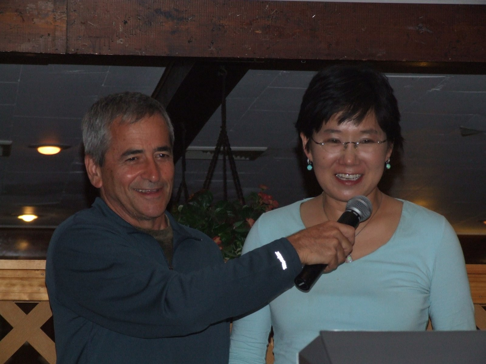

# A Note from my Husband

*Friday, March 30, 2012 at 11:38 PM*

An email from my husband to friends and family

When I read this, I was in tears..... in a very good way. I am a very lucky woman.

---

On a flight from San Francisco to Newark 3/29/12

A few days ago, sitting at the kitchen table, I told Hyeon that I came to accept the idea that she may die long before I do, possibly in a matter of a few years or even a few months. I hope this does not come to pass. I believe that if anyone can have a long term relationship with a deadly disease, it’s my wife. (Afterall, she was able to deal with me for the last 27 years.) But if it does come to pass, I accept it. Her premature departure from my life will sadden, but not devastate me.

Still, I really would like her to be with me for a very long time, I’d like for us to get old together, to enjoy travel and grandchildren, to keep each other company as our bodies become frail and our capabilities gradually diminish. Our bond has a strong spiritual element, and the spirit is less vulnerable to decay than the body. We don’t play golf together, we don’t draw pleasure from snorkeling in the ocean. We just love talking with each other. Our never-ending conversations nurture and sustain our relationship. At times the conversation is sad, at other time it’s funny, but it is always interesting (well, almost, let’s not get carried away) and it is very rewarding. It is through spoken words that we feel close to each other; if you know Hyeon at all you’ll be quick to understand that long loving gazes into her eyes are likely to elicit a “snap out of it” response. But she loves to talk to me, and I, in turn, would like to go on talking with her for as long as I can.

As you will see soon, there is another conversation in which Hyeon has an important role; the inner dialogue that I have with myself. During my childhood, my inner voice got off to a bad start. I don’t want to kvetch about my mother. I pay a lot to do this with my therapist. But over the years, my real conversation with Hyeon gradually reshaped my inner voice the one that is narrating my past, guiding my actions in the present, and defining what I see as my future. It’s an inner dialogue. But because of our intense emotional bond, because of our soul searching and honest exchange of emotions, observations and ideas, the inner dialogue morphed sometimes to a conversation with Hyeon, and this conversation with her will continue even if she is not around to engage in real life dialogue. Being able to continue this conversation will sustain me, it will make her presence in my life real as long as my consciousness is not altered.

Our kitchen conversation was rather short. I was not yet able to articulate my thoughts. I just said that I came to accept the idea of her premature departure from my life. As often is the case, Hyeon surprised me. She cried with relief, happy with the thought that my life will not be devastated. Her first reaction, after learning about her condition, was a resolution was to do anything within her power to protect her loved ones. She told me how intent she was not to leave a scorched earth behind. She is doing a fine job in preventing this from happening, but that’s a topic for another email.

One reason for my new found resilience is the realization that she will not be out of my life. I will continue to see the world through her eyes. I don’t always agree with her construction of reality, but most of the time, I know what it is, where she is coming from what dimensions of reality she focuses her gaze on. I will continue to listen to the world through her ears. Listening to meaningful conversation with great intent and enthusiasm, shunning the voices of chit-chat and small talk. I will continue to frame the questions through her eyes, even when I disagree with her answers. We often hold opposing interpretations of events and experiences. But I’m always able to understand her perspective, her motives, her intentions. So I will continue to hear her say that “nothing worth doing should be done in moderation” and that “sometimes you just have to work really hard at things that you don’t like in order to do things that you do like” or” don’t keep your loved ones on a leash make them come to you for the cookie that the learned to expect.”

Hyeon will continue to be my inspiration. Her conduct is central to so many things that I’m doing, so many new behaviors that I try. In fact, this essay in itself is inspired by her writings. On a side note, Hyeon and I always compete with one another. “Anything you can do I can do better” is our favorite duet, and we sang it enthusiastically to a room full of friends and strangers. I don’t believe that I have quite the knack for writing that she does, but hey, I’m not ready to give up the competition. I can still score some points toward the grand tally. And I’m a much better dancer. Ha!

Her voice will always be with me, too. Encouraging me, expressing trust and appreciation, telling me that I’m a good person. Making me feel that I’m good for her even when we bitterly argue as she goes on and on how my personality is faulty. The secret is that she got me to believe that, fundamentally, I am a very good person, and that even when she complains vociferously about my imperfections, she knows that I’m really a nice person and that I’m treating her well.

In the first few years, oh twenty or so, I was annoyed with the fact that Hyeon was always appreciative of the things that I did for her. While I, on the other hand, had little reason to appreciate the things that she did for me. Because she didn’t! She went out of her way to not accommodate my every wish, neigh, my any wish! So there was relatively little in her deeds that merited gratitude. Instead, I was appreciative of who she was, and what I learned from her. Unfair, I thought to myself. I have to work hard to accommodate her, and all that she has to do is be herself. But as I told my kids: life is not about being fair, it’s about a package deal that you get and it is either good for you or not. You don’t get to pick and choose and if you try to take out one thorny stick, the whole structure may unravel.

In retrospect I came to recognize that the fact that Hyeon never tried to please me out of a sense of obligation or duty was very good for our relationship. The fact that I could not make her do things for me gave both of us a tremendous amount of freedom. Since day one, we do things for each other because we want to, not because we have to. And we make this choice again and again, every day, every hour. And at any given time each one of us is free to say, no, I don’t feel like doing this and “I don’t feel like it” is a good enough reason. Though, as my kids will tell you, there are always consequences to the choices that one makes.

There is another bright side to the sad prospect of Hyeon’s premature departure. Her condition was a catalyst for wonderful changes in our lives. I’d trade those in a heartbeat for the chance to grow old together, but this is not our choice to make. We don’t choose the events in our lives, we only choose the manner in which we respond to them. And if Hyeon were to die before me, it gives me a great opportunity to find peace and joy in the knowledge that I can be there for her, that I have an extraordinary opportunity to express my love to her. I know I can be there for her all the way. I’m not scared. I can be her soul mate as she goes through the emotional turmoil of facing her own death, of saying goodbye to loved ones. I can be there physically holding her hand, caressing her body, lovingly gazing in her eyes. I will be sad when the time comes to for the last goodbye, but I’ll be there. And I’ll organize for her the best last goodbye experience that I can. If it comes to pass, I want to be there and help her let go of us. To make it possible for her to leave us without feeling she failed us. I know how happy it will make her. My hope is that the last voice that she hears will be mine, telling her how much I loved her and what a wonderful gift it was to have her as my life partner, as the love of my life.

I am married to an amazing person. And if I end up outliving her, and I still hope that this would not happen, the sadness of my loss will be balanced with a deep realization of how lucky I was to have her in my life. I was lucky to have met her and wise to recognize her virtue. Meeting her has profoundly changed the trajectory of my life.

We sat down for lunch at Lox Stock and Bagels, a student joint in Champaign Illinois. We talked for hours on end, six or seven hours. Before too long, Hyeon was telling me how much she would like to see the full colors of my parachute. That she would like to see me spread my wings and soar.

Oh, oh, my inner voice got startled. Thats alarming — there is a danger of commitment here. Nah, don’t worry! I’m going to go back to Israel in a couple of months. This is just a summer fling, and she knows it.

Well, she did get to see the full colors of my parachute, she did get to see me spread my wings and soar, but not as an observer. She was a participant, an enabler, she helped me make it happen. Hyeon challenged me to soar and convinced me that I could do that. She showed me the courage of the eagle, a bird who dares go higher and higher, and I rose to her challenge. I feel that the two of us are soaring in heights that few people get to explore. We see the world with clarity and calm. And if her time comes, and she is no longer able to fly with me, I will do this for both of us. I will soar above our children and grandchildren for as long as I can, and share with them the view from above, the world according to Hyeon. Through me, and through my boys, her courage, wisdom and generosity of heart will continue to inspire all who feel affinity with her. All those who appreciate her legacy.

---

*Sunday, April 1, 2012 at 11:46 PM*

Regarding my husband’s note: yes, I was very touched. I cried over and over when I read and re-read it. I feel like enormous burden has been lifted off my shoulder knowing that he will be fine no matter what. I am planning to stay around long time, but realistically, I am dealing with a medical condition that has a very unpredictable path. I have already outlived the life expectancy of my diagnosis. I am living on so called a borrowed time. No matter what happens, I am at peace. I will do my best to be a long term survivor, but it’s not 100% up to me. I accept that.

Throughout this period, my husband and my two kids have been thriving, and I am so enormously grateful for that. They are concerned, but that’s not what consumes their life. This is a true blessing.
