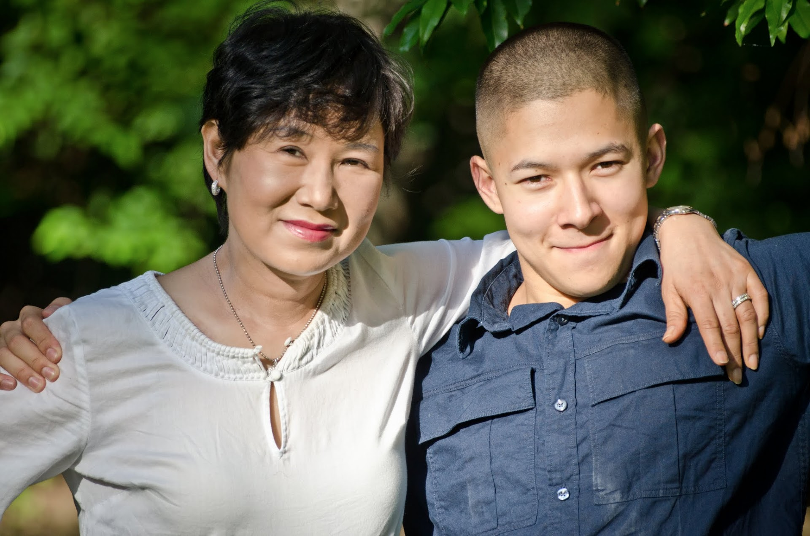

# Between When and If

Posted on college confidential 07–09–2011

A few weeks ago, we went to Jon’s high school graduation ceremony. I was happy to see him conclude his “juvenile” status on a high note — with much personal growth and with a full ride Army ROTC scholarship to a prestigious university. Yet, clearly for this kid, the best is yet to come. I said to myself that Jon’s graduation from college and commissioning as a US Army officer will indeed be a very special occasion since it is all about his dedication to hard work for the life’s goal that he chose for himself from the time of toddlerhood (I never thought one of my kids would become a solider!). He prepared all four years of his high school to win the scholarship and will have spent four years in college to emerge as a top Army officer. I was saying to myself, “I will be so proud of him when I see him commissioned”. Then, in mid sentence, I noticed a hint of hesitation in my inner voice with the word “when” — — should I use “if” instead?

I have always been a stickler for a precise choice of words — perhaps it is my attempt to overcompensate for the fact that English is not my native tongue. Regardless, I have always been vain about my ability to articulate abstract concepts with precision and emotional nuances with colorful visual imagery and out-of-the-box metaphors. I often choose a book for the beauty of the language and words, not for the most exciting plot. As a mystery buff, I used to read and re-read Dorothy Sayers’ books over and over again. Some might ask “Once you know the plot, what’s the point of re-reading a mystery book?” Ah, but we are talking about Dorothy Sayers — she may have written popular mystery books — not exactly the most profound thesis on the meaning of life and death, but her language and choice of words are exquisite — practically delicious. I read her sentences just as a gourmet explores a sublime taste of an exotic chocolate. Agatha Christie may be a good storyteller but her words do not have this allure — they do not inspire. Same with the science fiction — another hobby of mine. Isaac Asimov has wonderful story lines and power of imagination, but his words are insipid. It’s Frank Herbert’s language and words that excites me as they come alive in my head.

Up until eight months ago, most of my sentences about future events started with “when”. Now, for anything that is a couple of years or more into the future, I sense a familiar hesitation, an uncertainty on my part. If I were to make a choice each time between “when” and “if”, an anal book editor in me with a fetish for a precise word choice should and would choose “if” most of the time. Yet, I invariably choose “when” instead. Partly because I do not want to sound like a drama queen who constantly draws everybody’s attention to her problem. More importantly, because I do not wish to demoralize my husband and kids by reminding them of the precarious nature of my future. Yet, it is hard not to be aware of the reality that I can no longer take it for granted. As such, most of my when’s these days are a conscious choice over ifs against a better probabilistic judgment.

On the online forum of ovarian/uterine cancer patients, I started, for fun, a thread titled “Stupid Things People Say About Deadly Diseases”. Though there were some real gems that gave all of us a good laugh, the most common one was some variety of “well, we all could be hit by a bus tomorrow” line. I suppose it’s an awkward attempt by those who are fortunate enough not to have ever dealt with life threatening medical issues to make us feel better by pointing out that the rest of world is not better off than we. The difference being, we are more aware of our fate while those ignoramuses are happily going about with their routines not knowing what awaits them. I guess ignorance can indeed be bliss.

I am reminded of Cassandra of Troy. The common understanding of her curse is that she knows the future, the pending doom, but nobody would listen to her. The emphasis is on not being listened to. But one could easily argue that the true curse lies in the fact that she was given the power of prescience to begin with. When good things happen, the foreknowledge robs you of spontaneous joy of a pleasant surprise. When it’s a catastrophe and disaster, it dooms you to premature despair and amplifies the punishment beyond what the fate intended to mete out to you. I remember a Korean legend about a king who executed a famous fortune teller who had an uncanny ability to predict the future of anyone who sought his service. Those told of their good fortune in the future simply idled away their time waiting for the amazing luck to strike them. Those told of the pending misfortune resigned to their fate in despair. Either way, the fields were untilled and the animals unattended to.

But, what if Cassandra’s prescience had been truly a gift, not a curse? What if Trojans had listened to her? Then it could have been Hector dragging Achilles’ body around the walls of Troy. Odysseus’ ten year journey back home may not have taken place. Electra may have had no reason to seek vengeance on her mother. There is a thin line between a curse and a gift of knowing what awaits us. A curse, if you conclude that there is nothing you can do to change the chain of events. A gift if you conclude that with the foreknowledge of what might happen, you can affect the outcome. That what the oracle showed you may be the most likely future, but not a definite one. That between “likely” and “definite”, there are thousand shades of grey , and at any given moment, the eventual outcome can move along this spectrum wildly. That ultimately, you have the power to move as close to the lightest shade of grey on the spectrum as possible.

For patients with a life threatening diagnosis, I believe the prognosis is like this oracle as a gift, not a curse. It tells us the most likely outcome. Some people with my diagnosis may decide to “enjoy” life to the fullest now, whatever that may be. A surrender, even if it’s a bitter variety, not sweet, can be powerfully alluring. But I am one of those fools with the delusion of grandeur to believe they have the power to rearrange the likely outcomes — radically! I believe I have the power to change many ifs to whens not by wishful thinking but by actions and choices I make on a daily basis. Furthermore, I believe between “when” and “if”, there are thousands of shades to choose from. Even if I fail to change all the if’s to when’s, every time I bring an if a shade closer to when is a victory. This is what I should strive for every day. My survival is a matter of painstakingly bringing as many ifs as close to whens as possible. I intend to be a Cassandra with believing acolytes who will heed to her prophecy to change the course of the future.

I must admit though that this is not a unidirectional journey. Not all of my if’s move a shade closer to when as time goes by without retreating. There are days when they move back several steps — when I look at myself in the mirror and notice a twinge of fear in the corner of my eyes, when I lose a grip on something I was holding due to a belated onset of neuropathy a month after my treatment was over, when I read about the passing of a woman I got to know through online information exchanges…… Yet, as paradoxical as it may sound given the common assumption that people with my diagnosis are living on a borrowed time, the inexorable march of time is the most powerful engine for the forward movement from ifs to whens. Survival odds get better every day the patient survives, and this is especially so for advanced stage cancer patients. The five year survival odds for someone like me nearly double if I pass the one year mark. Every time I have another serving of kale and broccoli, a few of my ifs move a micro inch closer to whens. Every batch of blood results that comes back normal moves them a fraction of an inch. Every scan that comes back clean sends a few ifs all the way to when — a home run!

All things considered, my progress is directionally correct — as they would say when they monitor troublesome business affairs. But, it’s a dynamic process — the storyline of this drama is still being written, and there is no guarantee which direction it will head, and where it will eventually rest. I would like to believe that I am the principal writer, not some god in Mount Olympus that sends down the oracle etched in stone to hapless Cassandra. Who knows, there may even be a point of time in the future when I get fully rehabilitated into the “civilian” population full of people who never hesitate to use the word when. As it stands now, I am still watching these people from a distance with a twinge of nostalgia and a trace of shameful envy.
