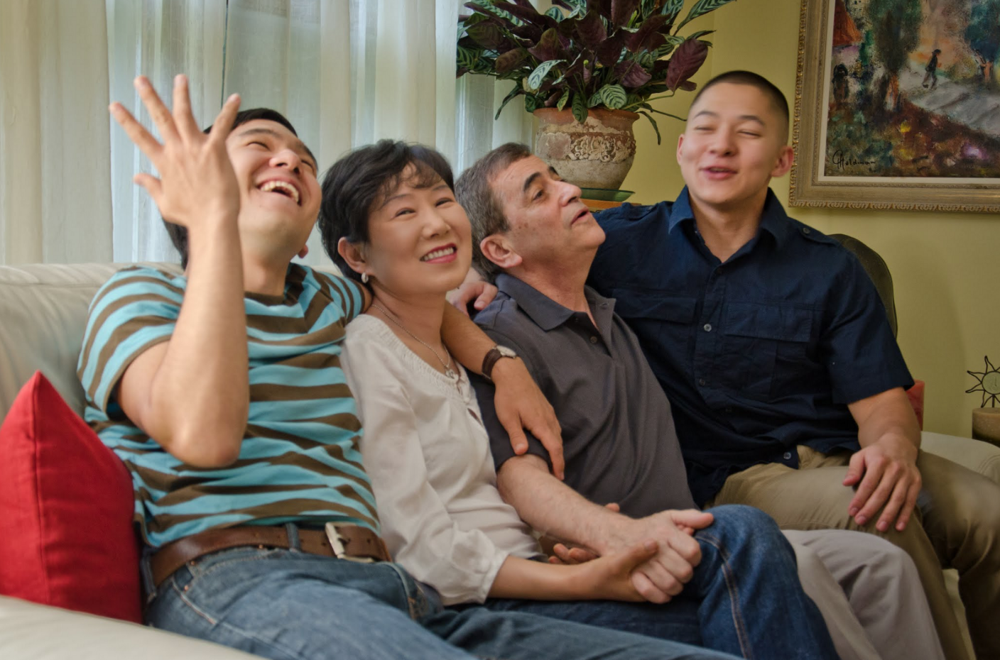
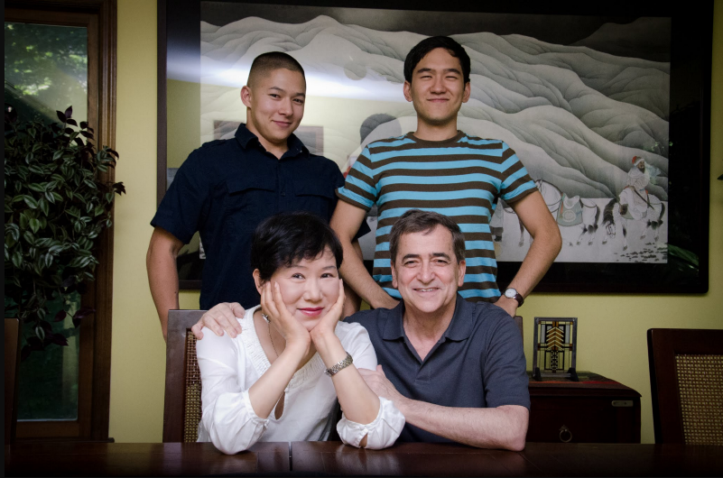

# Gamblers’ Anonymous? It’s Show Time Again!

6/24/12

One thing I learned over last year and half with very advanced cancer diagnosis and near non stop treatment is the stark realization that if I am to be a long term survivor, it won’t be because I am cured of cancer or because I managed to achieve a holy grail among patients with deadliest kinds of cancer — near permanent remission. When I recurred over nine months ago, I was still hopeful that the second time is the charm: I will achieve remission with one additional round of treatment and stay there for a very long while. That did not happen. Now, it is increasingly likely that my long term survival would be a result of successful management of cancer as a chronic disease — periods of treatment punctuated by blissful remission, or more likely, a constant treatment with a good quality of life if I am lucky

During last nine months, four successive regimens failed to put me in remission, though, I must point out that these treatments were not unequivocal failures either. My cancer is ferociously aggressive. At the time of recurrence, it took less than three weeks to move from complete remission to several tumors on the scan. For most women with a similar diagnosis, this process usually takes several months. Yet, lately, my cancer has demonstrated a remarkable restraint. The second regimen deployed for recurrence managed to wipe out the tumors, but alas, it quit working as soon as it wiped out the tumors and cancer started to immediately progress. Yet, its progression is uncharacteristically slow. After six month of rising blood cancer antigen markers, it has only now started to manifest itself as “thickening bowel walls” — a serosal accumulation of cancer cells outside the bowel walls. I find this highly encouraging in that while the treatments may not have reversed the course, they worked well enough to significantly slow down the progression.

When the cancer blood marker started to rise again, I purposefully chose a mild regimen, and when that failed, an off label experimental drug to slow down the growth. I did not expect them to actually put me in remission soon enough. My goal was to see if they manage to reverse the trend given enough time or, failing that, prolong the period before I need to bring out the big guns — the chemo that is powerful enough to give me a fighting chance for second remission but at a cost of potentially long lasting side effects. I need to manage my condition strategically — this means knowing when to use a stop gap measure and when to deploy a harsh regimen so that in between rough treatments the body has an opportunity to rest a bit on a mild treatment.

I was hoping I could postpone the onset of a harsh treatment till this fall. I have lots of plans this summer including a trip to Korea with Daniel. This is not to be. My cancer has a mind of its own. Though the scan still does not show easily identifiable tumors, I have become symptomatic. The accumulation of the cancer cells over the bowel walls is causing intermittent partial bowel obstructions and ongoing discomfort which at time is rather severe. Not only they can cause acute pain and severe bloating, they prevent me from eating properly and healthy. I was almost hospitalized but escaped the jail term since the obstruction cleared on its own while I was going through the admission process. If it becomes bad enough, I will need a surgery, but I am hoping it will not reach that point.

Hilariously enough, this also gave “voice” to my bowels — literally. I now have singing bowels. Loud gurgling noises that can be heard across the room every time I put something down my throat. One of the doctors at Memorial Sloan Kettering Cancer Center (MSKCC) explained to me that this may be due to the fact that food and liquid are trying to negotiate a passage through a narrow pass created by a partial bowel obstruction. I have always said I wanted to be an opera singer in my next life time. My bowels beat me to it. So, these days, I never feel alone — I am accompanied by a full orchestra. I am certainly not fit to be part of any polite society. Perhaps a temp position in a freak show… Are you grossed out yet?

Humor aside, I realized that I can no longer postpone the obvious — it’s time to bring out the big guns. Last week, I started on a new regimen. I am now on a weekly schedule, and the door to door round trip including the treatment time is 8–9 hours. It makes a very long day. So far, I have managed to avoid side effects from all the chemo treatments I have been subjected to. I expect (hope) that I will remain so. I can still make a two hour each way journey to MSKCC on my own — frequently walking from the Penn Station to MSKCC — a two mile walk — with a backpack, though I must admit my level of energy for high impact exercise did diminish after 1.5 year of near non-stop treatment. After year and half of pouring various kinds of toxic materials into my vein, I am mortified to admit that I now prefer an escalator over a staircase in subway stations. But, still, I bet I do better than 95% of the people without my health problem.

I suspect that I may lose hair again. This, I find, is a highly distressing prospect. It’s not just a matter of vanity. It’s a constant reminder of what it is I am dealing with. My cap or a wig is a portable quarantine cell I carry with myself no matter where I go — a fence of a sort that separates me from the “yet to be afflicted”. Going beyond the abstract, being bald will be a major problem when I go to Korea. Korea is a country of suffocating conformity. I hate my wig, and spent the whole time when I was bald last year with a cap even in the middle of the summer. There is no way I can get away with wearing a cap in the summer indoors without having it become a constant subject of discussion — which I need to avoid for my mental health. I have never told my mother in Korea what I have been dealing with all this time. I intend to tell her about it shortly. During last thirty some years, she has been my dependent for all practical purposes when it comes to an emotional and psychological realm. The original dynamics of parent- child relationship has reversed itself shortly after I entered college. She has never been good at dealing with bad news. I don’t know how she is going to handle it (not so good, I suspect). Having my wig silently confronting her every single moment she is with me is not going to go well.

When I realized a couple of weeks ago that the latest setback marks the fourth regimen that failed, I sat down and thought about what now? By now, I have a bona fide authorization to feel depressed and down by anybody’s standard — objectively speaking, I know where this latest data is going be compiled on a statistical balance sheet. I started with a very advanced diagnosis. It got worse when they had to leave a good lime sized tumor behind when they operated on me. The odds plunged again when I recurred so soon after I reached initial remission. Now, nine months into the treatment for recurrence, there is no end in sight yet and I am going through treatment options like Donald Trump does with perpetually twenty something wives.

However, I could also think about all that I was given — the uncommon privileges I was showered with. A good career that let me reach a fairly meaningful position without compromising my values and mortgaging my integrity. Two great kids who are thriving in spite of all this. A most loving husband. Great friends. Many people don’t get these in their lifetime even if they live to be 100. So, I chose to feel blessed — and it was not a heroic act achieved with a grim determination. Easy enough when I put all the “negatives” and “positives” in separate columns. There is such preponderance on the “positives” column. I am gearing up for the next round of this saga. I hope I do well. Losing four rounds in a row: this has never happened in my life. In fact, I haven’t failed much in anything I set my heart on, and I don’t think I ever failed in anything twice in a row! A humbling experience, I must say. You may think it would teach me humility. Instead, I get feisty and rebellious. I have an unlimited reserve of self delusion, and feel that in the end I will emerge in one piece. I don’t know how to explain this phenomenon: all objective data paints my case rather bleakly. Yet, I “know” in my heart I will be fine. The “rationale me” is puzzled by this level of delusion.

I think I know what it is. It’s a survival instinct. Not the demonstrative kind that shouts to everybody that “I will beat this beast and I will live!” with fire and smoke coming out of the nostrils, mouth, and ears — the popular image of a ferocious chest thumping hero. Mine is more a result oriented, practical variety. It does not waste its precious resources and limited energy on ostentatious plumage and a shock and awe display of resolve. Rather, it produces what I need most: optimism and a sense of self efficacy that prevent creeping fatalism that all this is futile from paralyzing me. After all, if I am not optimistic that whatever I am doing, whatever next course of treatment I will embark on is going to work, what point is there to sustain what appears on the outside as a losing battle? This is what my survival instinct is all about: to keep me psychologically and emotionally afloat — so that I keep researching all options, so that I stay as a highly engaged self advocate in dealings with all the professional staff around, so that I keep my “environment” intact and not damaged through my struggle, and most importantly, so that I never feel anger about my whole situation. I certainly did not spent a moment wondering why me. Stuff happens in life, in nature. When a tornado hits you, you don’t waste your energy being angry at it, you reserve all your energy to “deal” with it. I still don’t see my cancer as an enemy that I should beat to submission. I see it as a red haired little girl with a fiery temper. I will be the adult. I will be the one with a calm sense of balance.

[***Amir’s note***: Having realized that our time as an intact family was limited, I suggested to Hyeon that we get some family pictures. Hyeon understood my motivation, though we never discussed it, and did not like the idea. Then, by June, she acquiesced. As you can tell, doom and gloom were scarce.]

