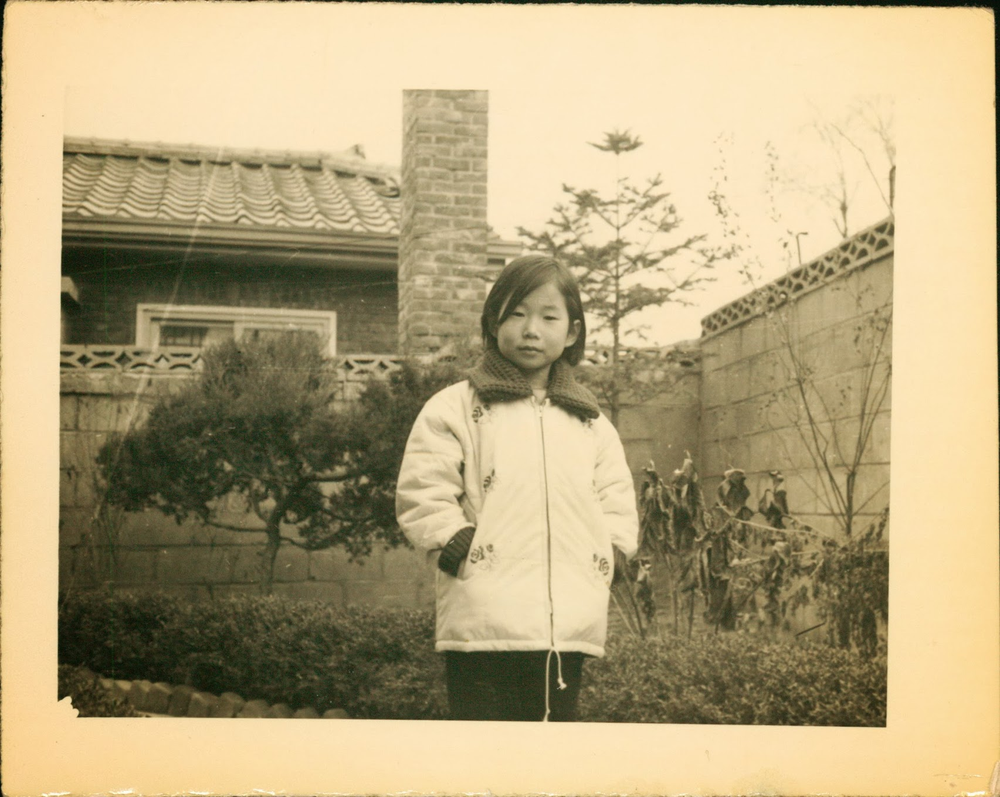

# Gratitude

Postings from college confidential

### Amir’s editorial notes

*Having keen interest in our kids college experience, Hyeon joined collegeconfidential dot com, a message board for college kids and their parents. A few days after getting her diagnosis, Hyeon created a new username: sunriseeast and started posting. I knew about her posts and respected her wish not to read any of them. She posted there with the freedom of having none of her friends or relatives read it and none of the readers know who she was in “real life.”*

=========================

sunriseeast — 11–01–2011 06:46 PM

thanks for your concern…..

I shared with my friends the last essay (the drug of my choice….), and several of them decided to “reform” me (or should I say “rehab” me), and I relented. I told them what I would appreciate most is cooked meal.

On this round, food has become a problem. I have only that much tolerance for doing anything to do with food. I can cook it or I can eat it, but I can’t do both: by the time I am done with cooking, I get so turned off that I can’t do it. My husband cooked for me, but there is only so many meals he can cook over the weekend — and I want him to be able to rest too. I did buy some prepared meals too (like Whole Foods), but I am a bit wary: they don’t make prepared meals with organic ingredients…… Last Wed, I was so pleased to have some appetite I went to a Chinese restaurant for lunch and sort of overate. Boy, did I pay for that or what. I used to joke that my stomach can digest a piece of metal and a piece of rock together. Well, not so. The food sat in the stomach like an anchor and won’t move. I threw up all night. I think lately my whole system has been tinkered so much that it is operating without much margin. I need to be more careful.

Anyway, last few days I have a barrage of cooked meals delivered to me by friends, and I have to say I feel SO nourished, not just nutritionally….

I remain very optimistic that the treatment is working very well (cancer-O-meter has been mostly quiet), though it’s hard on me. I get a scan next week: a bit scared, but I think it will show a great deal of improvement…..

Meanwhile, I have spent quite a lot of time over the weekend, checking all the insurance claims and what not this year, and I feel so lucky to have a good insurance. The size of the total medical expense so far could feed a town or a small city in some country for a year!

Something has to be done for the this whole healthcare issue.

=========================

sunriseeast — 11–01–2011 07:45 PM

to my credit, I supported the healthcare initiatives BEFORE I was diagnosed, when I was so healthy I never needed more than an annual physical check up and regular preventive dental care and armed with a iron clad health insurance coverage :) — the insurance I still have, but it’s a scary feeling: if we both retire before I am eligible for medicare, nobody will insure me unless the full blown health care initiative gets instituted….

=========================

sunriseeast — 11–20–2011 07:47 PM

swimcatsmom,

So sorry to hear about your husband. This is a lot to deal with. It comes without a warning and plays havoc with everything you took for granted.

I can tell you that you will regain your sense of normalcy sooner or later. However, it will be a different kind of normalcy. But there still will be laughter, joy, and love. Yes, there will be moments of sadness, a sense of loss, and longing for what had been. Yet, you will move forward and there will be things to look forward to.

Objectively speaking, I am at a place where most people don’t even want to imagine to be at, and even among cancer patients/survivors, this is a pretty daunting place to be at. Yet, there are everyday joys and happiness. I don’t look back and pine for what had been. Life is an evolution. It moves forward.

Best to you and your family.

=========================

sunriseeast — 11–20–2011 08:30 PM

May I share a bit of an ungrateful side of me? Just thinking about writing this post makes me feel like such a cad.

However, well, I am allowed to unload once in awhile in a safe place, right?

So, here are some examples of responses from my friends/relatives. All of them love me and all of them care a great deal. All of them mean incredibly well, and I am grateful for ALL of them. That said, I cringe at some of their responses, and actually started to avoid a few of them….. (by the way, the current situation has not been clarified yet. It could very well be the case that IT’S VERY GOOD, or that I am wrong. I will update you all when I have some data/evidence on where things stand. But on the surface, according to my doctor, things took the worse turn. So, people reacted to the news with the following…..

…..

*[Amir’s editorial note: As you can see below, Hyeon did not want our friends to read this. So I skipped the specific examples.]*

…..

Oh, I am bad, bad, and bad….. All of them are such nice people and well meaning. To my defense, I AM grateful, and I did not share any of these with anyone other than my husband, who said “would you rather I do all these, and have all of them come up with the kind of responses you find easy to deal with?”

He is absolutely right. My husband is pitch perfect. I love this man heart and soul. If there is an afterlife or reincarnation after all, I want to spend the eternity with him. I am blessed… truly……… absolutely……….. Completely …………….

=========================

sunriseeast — 11–22–2011 07:12 PM

Two hours ago, my S1 came home for thanksgiving with a bouquet of flowers. He is resting, so I am posting.

He goes to school in Chicago. We were not expecting him this Thanksgiving. He made a plan well before my recurrence to visit his best friend’s family in Kentucky. I wanted to see him, but I did not want to put a leash around his neck and reel him in. Also, I did not want to let the cancer dictate all that happens in this family, and I wanted to let the kids preserve as much normalcy as possible. So when he wondered out loud, upon learning about my recurrence, whether he should come home for thanksgiving, I encouraged him to stick to the original plan. After all, his school has a quarter system, and he will be home by Dec 9.

The doorbell rang, and I thought it was my S2 since he was coming home from Pennsylvania and he got a ride. So, I opened the door, and there he was! I was speechless. He told me that when he heard that the latest scan was not good, he decided to come home and wanted to surprise me.

I started to cry — out of joy and happiness. This was the best gift I got in years……

An hour ago, S2 arrived.

We decided to surprise my H. S1 will come downstairs suddenly after H is in the family room.

This will be a very happy thanksgiving indeed…..

=========================

sunriseeast — 11–23–2011 10:48 AM

S1’s face at the doorstep yesterday, that goofy grin and a bouquet of flowers he was holding — — — I will never forget.

I realize that this was a marking point for a fundamental realignment of our relationship. That, he is no longer my dependent (though, I still have to pay exorbitant tuition for another year and a half ;) ). Yesterday, he became an adult child who will come to his ailing parent’s rescue, not that I hope we will be in a position to need “rescuing”.

I am also very grateful that it happened this way. He did not come home because someone had put a guilt trip on him for his “ailing mother”. Coming from a culture where guilt is fed by an older generation to a younger generation on a maximum dosage day in and day out, I vowed never to do this to my kids even if that means that I may be “neglected” here and there. But in the end, I got my cake and ate it too.

I feel profoundly thankful this morning…..

=========================

sunriseeast — 11–23–2011 10:19 PM

on the eve of thanksgiving, I would like to tell here everyone “THANK YOU” from the bottom of my heart. You have been SO incredibly generous and kind with me all throughout this journey.

You have no idea how much your support and kindness meant to me. Though I am not thanking all of you individually, please know that I am incredibly grateful.

thank you…..

