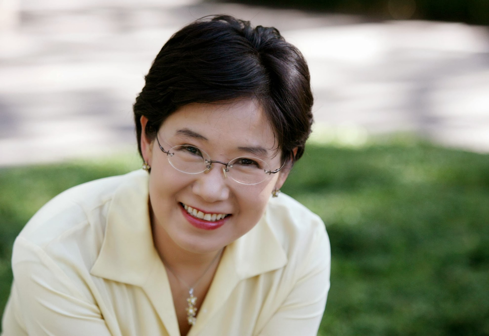

# Hyeon Jeong Lee

*A note from Amico, the editor.*

A few weeks before she passed away, my wife, Hyeon Jeong Lee, shared with a dear friend an unusual observation. “The three best things that happened to me,” she said, “were leaving Korea, meeting Amir, and getting cancer.” It’s been over three years now, and I’m still trying to fully understand her statement.

Most of this blog will consist of what Hyeon wrote from the day that she was diagnosed with cancer to the time that she was no longer able to write. It is a collection of emails messages sent to friends and family, postings in a college forum and some essays. My hope that sharing her writing may help some people to find peace and beauty in the most dire life circumstances.

