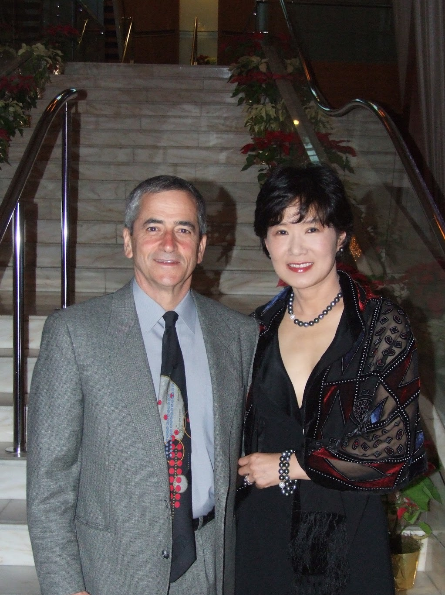

# Intense Days

*Wednesday, December 8, 2010*

Intense two days — yesterday and today.

Yesterday Amir decided to work from home and accompany me to my appointment with my primary care physician. She already had good enough inkling about what she was dealing with when I first walked into her office to order a blood test that included the ovarian cancer marker, ultrasound and CT scan. She shared the results with me over the phone, but also offered to sit down and talk to me before my appointment with the oncologist. I love Dr. Hayward. She is the perfect example of a wonderful family doctor: highly competent and caring with a gentle manner. A terrific combination. I don’t know who was more concerned: she or me. It was clear this is a tough session for her. She asked me if I needed a prescription for sedative or something that would let me sleep. No, I don’t.

I thanked her for being patient, spending the time to explain things fully, and letting me ask questions in a very supportive environment. She said “well, usually I don’t get “thank you” for delivering news about malignant tumors”. I always try to look the situation objectively, as an outsider looking in. Simply the fact that I have cancer does not mean that I am the center of the universe. This happens countless times all over the world on a daily basis. On a macro scale, this is a rather mundane event.

In the evening, we went to the holidays party at my husband’s workplace. It was a lavish affair. They rented the whole MOMA. Gotta give them credit for taste and style. When first invited, I had no intention on joining this party. I am not much of a fan for a big bash — I much prefer a quiet and small gathering of close friends in a relaxed setting. I don’t get excited about fancy parties.

However, to be perfectly honest, the reason why I wasn’t excited about this particular party was because I did not like to be “the wife”. If I were to visit his workplace or meet his colleagues, I wanted to be on my own terms, not as a wife. After all, his company is in my line of work — my professional field. This, I must say, is arrogance. I fully admit it. I have never been as nice to my husband as he has been to me, I believe. My petty sense of pride and self importance prevented me from just doing it for him — just joining his party as his wife.

My cancer diagnosis changed all this. As much as I am optimistic and hopeful, there is always the possibility that I may end up on the left side of the statistical distribution curve. I need to prepare for that possibility too while I do everything within my power to emerge as an outlier on the far right tail of the curve. It’s not all about me anymore. It is more about what I leave behind — just in case.

I wanted to go to his party. So that if something were to happen to me, this would be the day I start writing a book full of beautiful memories for my husband. I want him to see me as his elegant wife dressed in a formal gown and bedecked with my best diamonds. I want him to be able to parade me around. After all, I am a darn good looking 51 year old. Let him enjoy being seen with his first wife who could easily pass off as a trophy wife. This disease is no longer about me. It’s about him, more than anything else. What can I give to him and what can I leave behind in case I don’t emerge intact? I do feel I have the responsibility to do my best to leave the best and sweetest of me behind.

I don’t feel as much sense of responsibility for Jon and Daniel. They are wonderfully well adjusted kids, both in their own way a terrific success already. Their life is so full of promise. What I needed to give them, I already have given them — most of it anyway. More than anything else, the biggest gift I gave them is the kind of man I married who became their father. They have the best father anybody can possibly ask for. Even if something happens to me, their life will be full and rich, and their father will fill most of the gap. They will be sad, but they will move on and live fully.

We came home, tired and, believe it or not, content — at least I was.
Today, this morning, my husband accompanied me to a first session with my gynecologic oncologist. Based on my research, he is a very good doctor well known in his field as an expert. However, some women complained that he did not have a warm and fuzzy bedside manner. Well, some women are looking for love in all the wrong places. I will choose competence over sweet words any day.

Lo and behold, he did turn out to be a rather stern looking, taciturn guy. I can see why some women feel small in his presence. No such problem on my part. I grew up as a daughter of a general who terrorized tens of thousands of soldiers in his command. I have seen this “scary” man come home and be chided by his wife, sit on the toilette ball battling with constipation, barf and burp, and yes, get frustrated to no end losing a battle to a 10 year old stubborn daughter. The authoritarian scary men do not scare me at all.

A good prospect: he explained that even though CT scan showed cancer nodules in the liver, they have no way of knowing whether they are ON or IN the liver. “ON the liver” avoids stage 4 diagnosis. So, the eventual diagnosis that will emerge after the surgery may be better than the worst I thought it might be. It’s always good to be hopeful, but until I know exactly what it is, I would rather go in with the worst possible scenario and see my odds improve successively. I would rather start at the abyss and claw my way back up than feel like I am slowly sinking in the quick sand.

I asked for a surgery as soon as possible. In the end, they were able to schedule it on Monday (12/13). This is good. It’s as soon as it can be done, and after Daniel comes home this Saturday so that we can have a measured family discussion before things become intense. In the afternoon, I packed my husband off to a business trip. It was on his calendar but he was reluctant to go. I told him, there is nothing going on today or tomorrow. The surgery is not until Monday. I don’t want my disease to be the defining phenomenon in this family. It shouldn’t have that much power. This is a marathon, not a sprint. Everybody has to pace themselves. It’s important that we keep as many routines as possible intact.

Last few days seem like a decade. What will next few weeks bring, nobody knows, but I soldier on.
