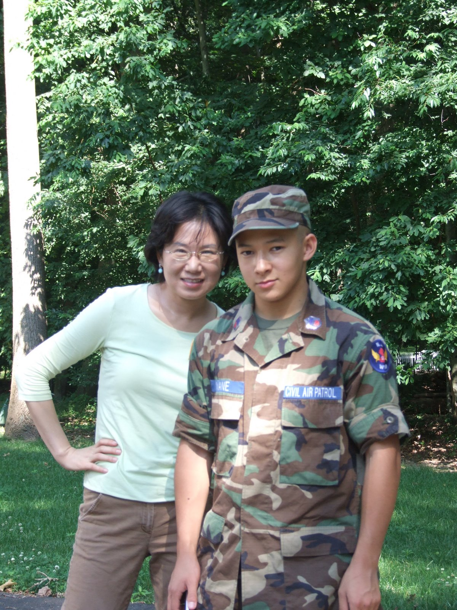

# Musings On College Confidential

sunriseeast — 04–19–2012 01:17 AM

[Editor’s note: This is a post Hyeon made on College Confidential, followed by some of her on-thread replies.]

Hello, everybody.

Just to let you know that your favorite ;) late stage cancer patient is still alive and kicking….

It’s been three weeks since I started on a new regimen. I go to MSKCC once every three weeks, and the rest of the time, I am a pill popper! Chemo in a pill — cute, huh?

I shared my latest essay (The Absinthe Drinker and David) with my handsome boy toy doctor at MSKCC. It may sound like a bit of an exhibitionist antic on my part, but the motive was very much rooted in my desire to emerge as a long term survival. I wanted to present myself as more than a patient number XYZ — a collection of tumors with two feet. Dr. S. is a kind, caring gentleman, so far as I can see, but I am greedy — I want to be more than just one of his patients. I want to be something (someone) special — so much so that when he thinks about my case and my treatment, he pauses and thinks a minute longer — a bit more involved than usual — a bit more care and thoughts that will propel him to think more innovatively, more out of the box, and more inventively. If all usual remedies have been exhausted, I want him to push the envelope and reach far and out for potential options still open for me. I want him to not give up. In the cyber community of patients with my diagnosis, I hear stories of patients whose doctors told them there is nothing much more left to do — so early in the game. In fact, a woman who started this journey around the same time as I, and has been on a similar trajectory like mine (early recurrence, failed treatment, etc) was told by her physician that there isn’t much left to do for her, while Dr. S told me that I barely scratched the surface of all that they could do for me. He is an outstanding doctor, so I am sure he does his best to help all of his patients. However, one thing decades of a corporate life taught me is that there is “doing one’s best” and there is “REALLY DOING ONE’S BEST” — often the distinction is at a subconscious level.

Among cancer patients, it has become quite fashionable to become hyper assertive with the medical staff. The pendulum swung very widely lately. There are actively engaged patients who are over compensating the image of a docile and passive patient who has a blind faith in a highly authoritarian physician. There is even a booked titled “Patient from hell” — a story of a hyper vigilant patient who managed to get more out of his treatment by being hyper aggressive and demanding.

I do not buy into this. When I was running a large organization, I never felt that the “stick” approach was a good option. It may work on a short term basis, but is never sustainable on a long term basis. AND, I intend to have a very long relationship with Dr. S. I want him to go an extra mile for me because he genuinely cares and because he is personally invested. In short, I want him to be sucked in my psycho drama. I want to gently engineer the path for him to be an active participant in this show so that he will be personally invested in making sure that the show goes on.

So, I opened myself up. I bared my emotion, my thoughts, my fears, and most importantly, my hopes in an effort to ensnare him into my lair. Perhaps, I forced a degree of intimacy that might not be welcome. But, I risked it. Surprisingly, he sent a very warm email response back: how much he enjoyed it, and how moving it was. Then, he connected me to a program director of a patient support program at MSKCC called Visible Ink. It’s a program that pairs their patients with volunteer professional writers on a one-on-one basis. It so happened that their annual event was this past Monday. I was invited, and I thoroughly enjoyed the event. They selected a bit over a dozen essays written by their patients and professional actors and singers performed the essays. Perhaps, next year, I may have the honor to have my writing included in the event. Today, I heard from a volunteer writer who was paired with me. I am very excited about getting to know her: she teaches at Smith College. When I was diagnosed with a very poor prognosis, I vowed that no matter what happens, I will make sure this cancer will let me be more than I have ever been, not less. I will not shrink. I will expand. Expanding my horizon into the community of writers and their world, the kind of world I have not been exposed to before is a new experience. One small way that I will be more than I have been, not less. I am excited.

Today, I had my regular consult with Dr. S. I gave him another essay. I told him that I intend to share one essay every time I see him, and just like Scheherazade’s caliph in The Arabian Nights, if he wants to hear the next story, he will have to keep me alive till next time.

=========================

sunriseeast — 04–19–2012 06:44 PM

thanks for such encouraging words.

today, I got the latest blood test results back…. Not good. the early indication is, this new treatment may not be working.

So, kind words from all of you were very nice — they soothed me.

I never thought that this new treatment protocol ( a very gentle one) will put me in remission, but I was hoping that it will buy me some time so that I can do a lot of traveling this summer before gearing up for the heavy duty stuff later.

The good news is, the cancer is progressing slowly. So, it seems while it’s not working extra well, it is helping in preventing the cancer from going out of control.

I feel like a little child strapped in a car seat, constantly asking “are we there yet” — except, in my case, the destination milepost seems to be constantly moving further away…..

I am starting to explore options outside the boundary of the conventional medicine. Statistically speaking, I am a very high risk patient, and as such, the risk/benefit equation that does not hold for someone with 90% of survival is worth the chance. I am not talking about crazy stuff like “eating cockroaches to cure cancer” claims. I am talking about scientific, but at this stage, highly experimental stuff. I have already done the homework for these.

If you want to know what they are, you too must send positive energy in my way to keep me alive to hear the next story: The Arabian Nights, folks!

(I spent the whole day today metabolizing the latest setback. I am back on my saddle now)

=========================

sunriseeast — 04–20–2012 02:45 PM

Oh, Creekland, you are a virgin (to this thread!)

Welcome to a one woman freak show!

=========================

sunriseeast — 04–23–2012 12:31 PM

Well, since you all heard me whining last few days about my latest treatment setback, I would like to share something good.

over the weekend, my H and I went to visit S2 at his college (overnight trip). It was for an award banquet for students.

I don’t want to provide too much detail, but suffices to say, he got the best award he could possibly hope for: the overall best student award, reflecting academic, leadership, and all other dimensions that matter in his chosen field among freshmen. If he keeps at it year after year while in college, it translates into a really fantastic career development path going forward.

His beaming face was priceless. As you all know, with the latest setback, I was in a somber mood, and this really cheered me up! This is a kid who was in his older brother’s shadow all his years growing up until he went off to college. S1 is a freak and a force of nature, and it’s hard to shine brightly when the room is already lit with megawatt light bulb. I have always told S2 your brother is good at what he has chosen to do, and you are terrific at what you have picked” But, these days, he finally internalized that. These days, when I see the two of them together, I can see how S2 stands tall with his older brother, and with how much respect S1 is treating his younger brother. It’s beautiful to see.

One benefit of an advanced stage cancer patient label is that now I can brag about my kids. People probably give me a pass on that — — “that poor thing. She HAD TO say something positive about her life once in awhile….” This is a new week beginning. I am up to whatever comes my way…..

sunriseeast — 04–23–2012 04:27 PM

Lilmom,

which one? S1 is currently taken. S2 is not. He has a lot of female friends, not a girlfriend.

By the way, I think it’s a good sign that both of my sons have good female friends. I am always suspicious of men who do not have good women friends. I think men who relate well to women as friends, as people, colleagues, partners, etc are the ones who make a good husband and father down the road. Passion comes and goes, but understanding and empathy are what sustain a long term relationship in the end.

