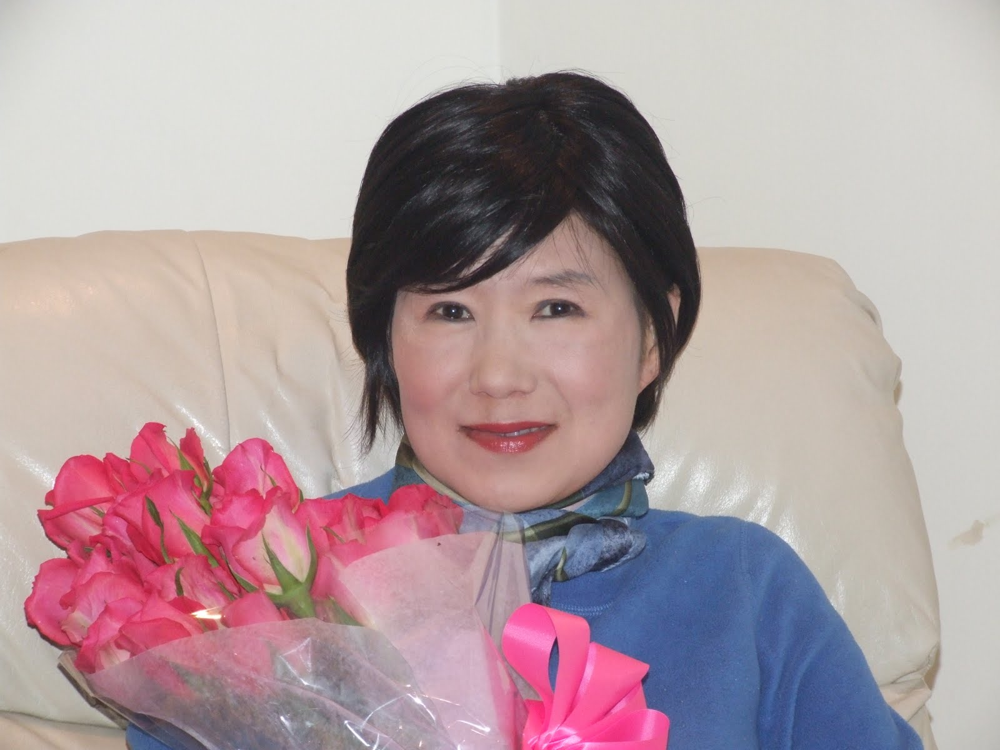

# My Life as a Guinea Pig

# 6/27/11

Dear Friends,

Latest update: I have joined a clinical trial for cancer vaccine at Memorial Sloan Kettering Cancer Center in NYC. This is a trial for high risk women who just achieved their first remission.

During the last 4 weeks of my chemo treatment, I thoroughly researched all the options for continuing treatment (in case I don’t go into remission after the standard chemo treatment) and options to boost my odds for long term remission in case I go into remission.

Luckily, I did not have to revisit the continuing treatment option (even though I did much, much more research on this scenario).

The default option for those who go into remission is passive (though vigilant) monitoring for any sign of recurrence. That was not acceptable for me.

Any medical intervention has its own risk. As such, it all boils down to the risk/benefit analysis. If my cancer was the kind that has 95% survival odds for 5 years, the best thing is to monitor passively, since the marginal benefit of medical intervention may be at best negligible or even negative.

Based on everything I read, I am a very high risk cancer patient with a near 100% rate of recurrence within a couple of years (at least based on available studies and what not). For someone like me, the risk threshold is very high, meaning, a risky intervention is well worth the potential benefit.

I had two general categories of intervention. One was maintenance therapy: basically, what it means is that they give you chemo drugs on an ongoing basis at a much lower dosage. The other is joining a trial that tests the effectiveness of recurrence prevention options. I decided to join a trial.

My logic was straightforward. If I were a business, I am a business about to go bankrupt (high risk). A normal turn-around strategy based on cost cutting, better marketing, better quality control, streamlined distribution channel management is no longer sufficient. I need a paradigm shifting solution that will change the “vector” of the trajectory. In short, I need a new business model.

Even within the trial category, I chose the vaccine trial, rather than a trial involving new kinds of drugs. I concluded that a vaccine trial fits the metaphor of paradigm shift better. Instead of a drug that may be slightly better than its peers in killing off cancer cells, a treatment based on the vaccine angle focuses on the body’s own ability to fight off aggressive cancer cells. Think of it this way: rather than trying to come up with a better drone that will kill more terrorists while minimizing civilian casualty, you can arm and train the local police and military force who will take care of the terrorists on their own.

So during final several weeks of my chemo, I researched and picked out two trials. One is a phase II trial with random assignment (meaning, you may or may not get the vaccine). The other is a phase I trial where everybody gets the vaccine. The moment I was declared in remission, I applied to both: I had a slight preference for the phase II trial, but I may be assigned to the control group (no vaccine), and if that happens, I wanted to participate in the phase I trial. Lo and behold, I qualified for the phase II trial, but was assigned to the control group. So, the choice was made for me: the phase I trial at Memorial Sloan Kettering Cancer Center. This one has very stringent eligibility criteria, and today, I was told that I qualified. So, I AM IN.

Going through all this, I realize more and more how active and well thought out initiatives by the patient make all the difference. Most doctors do not recommend trials to their patients: there are so many trials going on, so other than those they are personally involved in or aware of because their institutions are involved in, doctors themselves cannot possibly keep up with all that is going on. Especially trials for those in remission has a very narrow window for qualification (8–12 weeks from the last chemo infusion). It takes about 3–5 weeks after the last infusion to confirm that the patient is in remission. It takes several weeks to go through the application/qualification process. So, unless you thought through all this while still getting the chemo treatment and know exactly what needs to be done, you won’t be able to join. Furthermore, I am glad that I applied to two trials simultaneously. If I had applied to only the one I had a preference for, for which I was assigned to the control group, it would be too late by now to start applying for the MSKCC trial.

So, I am officially a guinea pig now. Wish me luck on this new journey!

6/28/11

By the way, Memorial Sloan Kettering has a completely digitized on line access system for all the test results, treatment activities, appointment scheduling, billing, etc.

You have NO IDEA how I was literally aroused as I was going through the online account activation process and finding all the lab results right then and there at my fingertips. They even provide a trend analysis on your key numbers. For a type A freak like me with a fetish for numbers and data, this is an unbelievable treat.

* Ahhhhhhhh the white blood count here.

* OOOhhhhhhhhhhh the red blood count there.

* ah, ah, ah cancer antigen marker number!

* Yooooooooooo albumin count!

* Ummmmmmmmmmmmmmmmm glucose count..

Need I go on? I feel like Sally in the movie When Harry Met Sally.

Don’t laugh and snicker. We ALL have our own perversions. It’s just that I am more open and willing to admit it.

