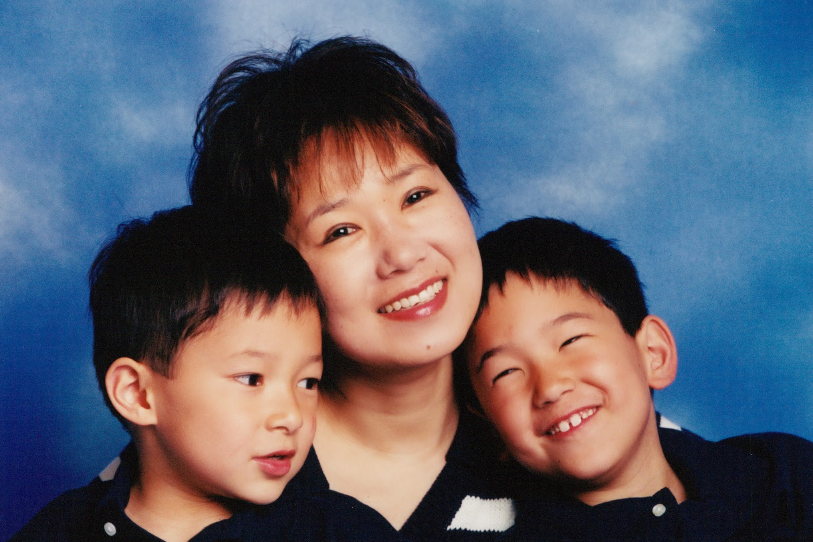

# Orchids and Vegetables

**5/4/11**

The other day, when I came back home from a doctor’s office, and was walking from the garage to the family room, I heard a baby crying. The only car I saw on the driveway was Jon’s car. So, understandably, I was intensely puzzled. That puzzlement turned into a minor shock when I saw him holding a baby, nursing him with a bottle. On a closer examination, I realized that it was a doll the size of a couple of month old baby. Turns out, it’s one of those teen pregnancy prevention projects as part of the health education curriculum. Each student is given a doll to take care of for a day. The doll is programmed to behave like a typical newborn, that is, it requires constant attention and care with no respect for the caregiver’s other priorities and plans. Unless held to the chest on a regular basis and/or fed and caressed it wails incessantly. I guess the idea is to press upon the teenagers the weighty consequences of their behaviors and choices.

This younger son of mine is an aspiring macho man, determined to pursue a career in military. The scene of him cuddling a newborn baby doll was simultaneously hilarious and incongruous, and yet so eerily natural and reassuring. I have always known that beneath that tough man façade lies a very sensitive and nurturing young man. I have always thought that one day he would become one hell of a father, but that belief just became so real and convincing to me in that instant when I saw him cooing the baby doll. And the desire to live to see that eventuality became overpowering.

Before all this happened, when I have thought about what I could do as a grandmother, it was all about how I would subject the grandchildren to the same kind of torture my kids had to endure — the endless trips to all the boring museums in the world, and educational journeys to hidden corners of the world. But, that day, watching Jon with this doll, I had this simple desire just to be there when it all happens, to see him wiping the nose of his kids, and Daniel trying to teach his kids how to “observe” people (analyzing people’s psyche is his latest obsession).

Some of those with whom I have shared my various musings since I started this journey might have wondered why I rarely talked about my kids: after all, all third rate tear jerking family movies starring mothers with a deadly disease would have a line that runs more or less like this one “Oh, I can’t die. I need to be there for my children! They need me.” Well, in my case, this is one business I can say “largely finished with no untied loose ends”. That explains why what my uncertain future might do to the kids has never been a source of angst for me throughout this journey.

No, they are not completely independent adults. Yes, at age 19 and 17, they are still going through a formative period. Yes, they will be very sad if I become part of the statistics (given how bad the published stats for me). But, NO, they will not be adversely impacted beyond what a bit of time and reflection cannot reverse. Whatever happens to me, they will emerge happy, well adjusted, and successful individuals well respected and loved by those who get to know them. I am secure in my conviction that whatever I needed to do as a parent, I have completed it already. My legacy is secure in the kind of outstanding young people they have already become. My values have been already transmitted, internalized, and embedded at the core of who they are. Furthermore, emotionally rewarding relationship I have with them means there is no baggage that will haunt them for years to come in case of my untimely demise.

I have to admit that my style as a mother has never been a conventional one. I was simultaneously neglectful and mindful.

I have never been interested in doing cute art projects with them. I was fairly cavalier about what they eat, when they go to bed, and whether they were doing their homework or preparing for the exams. Truthfully, I found school performances mostly uninteresting and uninspiring — simply the fact that my kids are in it does not make the poorly put together Lion King suddenly appealing. Kids’ soccer matches and other such sports spectacles bored me to tears. I was never the one to make a big ado about their birthdays and other rite of passage events. Elaborate Bar Mitzvahs? No way. I am allergic to big ceremonies: I couldn’t even stomach the idea of my own wedding, and was happy to get it over with at a courthouse. I already told my kids that there would be a special elopement bonus when it comes to their turn. And, a sin of all sins — I worked the whole time — leaving their day to day care and feed to a stranger for close to 15 years (a woman who eventually became a treasured family friend).

Yet, I was ever present, 24x7, when it came to the emotional and intellectual environment they were growing up in. As a parent, I have always thought of myself as an ecosystem manager, or should I say, a conductor, rather than the first violinist. I was charting the course of their life 70+ years into the future. Back in my mind, I have always been doing reverse engineering — if I want my kids to be a phenomenal success in their own eyes when they are 90 years old, what should I be doing now? I came to the conclusion that the most important skill they need to learn is to create and manage their own ecosystem where they will thrive, and my role as a parent is to help them develop this critical skill.

I believe that the most important ingredient of this skill is to develop mutually rewarding, reciprocal relationship with those around them that matter to them. I genuinely believe that their relationship with others is far more important than their relationship with me. It is more important that they respect and be respected by others than they maintain a close relationship with me and be devoted to me. Most would think these two dimensions are orthogonal — totally independent dimensions, not an “either or” dichotomy. I beg to differ. If we were to compile an anthology of toxic parenting, there will be many chapters devoted to parents whose deep seated, and often unstated, desire to “monopolize” their children’s universe prevented the children from forming a balanced view of the world and their relationships with those around them.

There is also a cultural element to this whole equation. I grew up in a culture noted for heroic sacrifices parents make for the sake of their children’s success and achievement in life. Stories of college educated parents who immigrate to USA and become chicken factory workers so that their children have a shot at becoming a Harvard educated doctor abound. This cultural trait is much touted as a recipe for a stellar success for Asians in both their home country and as recent immigrants to Western societies. Yet, there is a darker shade of truth underneath all this. The sense of entitlement on the part of the parents to claim their children’s success as theirs and their wholly justified (in their mind) expectation for “rewards” are also real, often overpowering, and yes, at times debilitating from the perspective of the children.

But even outside the boundaries of the cultural norm among certain ethnic groups, I believe it is easy for parents to fall into this trap, albeit in a much diluted form. For me, who I am as a parent not only reflects where I came from and how I internalized certain values and norms of my own upbringing, but also what I consciously chose to reject. When it comes to parenting, I chose not to be a farmer, but rather become a gardener. A farmer grows crops for utilitarian purposes. A gardener draws pleasure from watching her handy work blossoming — there is no “useful” purpose to this. I wanted my children to be my orchids. Their role in “my life” is to become that thing of wild, untempered beauty free of any designing scheme, expectation, and anticipated reward on my part. I want them to be free of my desires, wishes, and needs. I want them to have an innate sense of freedom to fly away from me in search of something grander and more beautiful than what I can give. If they were to become kind, caring, and thoughtful adult children of an aging mother, I want it to be a natural expression of their love for me, rather than a premeditated act born out of a grim determination to do the right thing. I want to enjoy them as a gardener watching a blossoming orchid — the sight of its luxuriant bloom and the whiff of its natural fragrance even if it is from a distance. I do not wish to enjoy them as a farmer would by “consuming” the vegetables — turning them into salads, and putting them through a blender and a juicer to forcefully extract what’s good in them.

When I first got my diagnosis, amid a myriad of mixed emotions, I felt profoundly grateful that this happened after most of what I set out to do as a orchid gardener has been completed. The ecosystem of the garden is operating at a maximum capacity. The soil is fertile. Climate has been created just so. I could already see some indications of the wildly beautiful blooms to come in the future. I have every intention to do everything within my power to emerge as a long term survivor, but even if I fall right in the middle of the statistical distribution curve (which means, I may not even be around to see Jon’s college graduation), I have no regrets and no worries. My children will be sad, but not bitter. They will continue to develop as orchids, not as weeds or somebody else’s vegetables.

I had one fear though. That is, the fear of leaving a scorched earth behind me if my grand scheme of becoming a long term survivor does not pan out — the landscape littered with devastating emotional debris and bitterness for Amir and the kids. Within moments of my diagnosis, it became crystal clear to me that amid of all this, there is one thing I, and only I, have a complete control over. I can’t control what will eventually happen to me, but I can completely control how I respond to it. My response will mean a difference between leaving a scorched earth or a fertile valley behind in case things do not go as I planned. From the very first moment when my family learned about my condition, every word and every little act on my part determined what kind of psychological reality they will be living in, not just next few months but perhaps even years to come. That, it’s all up to me — I have the singular power to determine what it will be. For a Type A personality freak like me, this presented a galvanizing opportunity to rally around. How often does one have an opportunity to work on a mission where she, and no one else, has a complete control over? For the orchid garden that I tended for close to 20 years, my cancer did not have to become the spring frost or drought that would ruin the bloom. Instead, it could become a different kind of a fertilizer that will bring even more exotic hue to the natural beauty of the orchids. As a gardener, this is exactly what I set in motion within moments of my diagnosis.

A few days ago, Jon blurted out when he camae home to see me exercising “Mom, you are virtually indestructible! I thought I would have to baby you and coddle you during your chemo, but you are giving me no opportunity!” I guess it’s his way of saying he is relieved that I am doing well. These days, I see Jon as much more mature and anchored young man — in good spirit, full of hope and excitement for going away to college this fall. I wouldn’t know whether he grew more mature as a result of what happened to me and how I responded to it. But I do know that what happened to me did not turn him inward and bitter with his natural growth thwarted. The other day, I was talking with Daniel over Skype, and I was sharing with him my observation that cancer took away certain things from me but also gave me gifts that I did not see coming. That, in aggregate, I view cancer as a net positive impact on my life, even if I have to shave a few years off my life expectancy. He blurted out, “Mom, you are almost making me feel cheated for not having a cancer of my own!”

There are few things in my life that I can genuinely say, “I accomplished this, and I am proud of myself” — many of my accomplishments are byproducts of fortunate circumstances I found myself in, and can’t be wholly attributed to my, and mine only, actions and choices. But, for this, I will claim credit — that I managed to enrich the orchid garden by turning potentially toxic chemicals into wonderful fertilizers — that, my kids learned through this whole process that one can find beauty even in the worst train wreck if one knows which debris to lift to find it.
