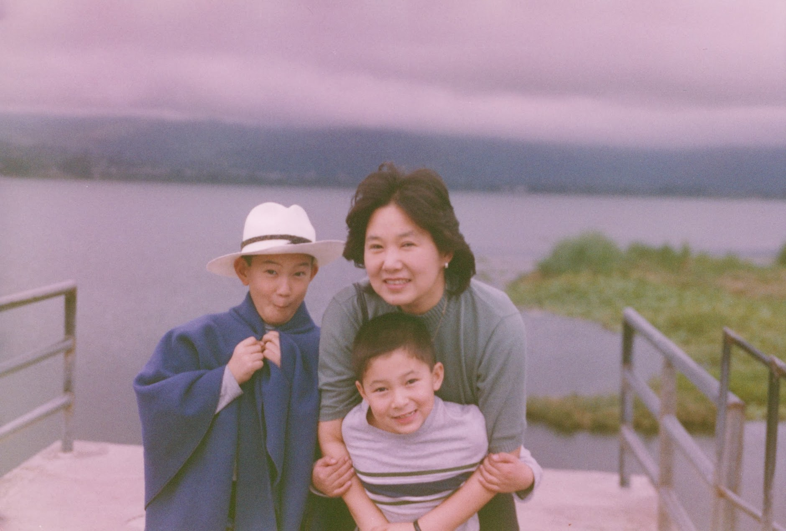

# Road Trip

*Monday, June 20, 2011*
&middot;
*posted to College Confidential*

Two days before I was scheduled to have an operation, I went to a bookstore to buy a few interesting pieces to read while I am recovering from a major surgery. The first thing that caught my eye was a travel book titled “1,000 Places To See Before You Die”. Having spent a few days gorging on one series of grim statistics after another on my survival odds, I had a gut reaction of dismay — Geez, they gotta come up with a more manageable list now for people like me! As optimistic as I am, I am also a realist. So, in the end I settled with “The Most Scenic Drives in America — 120 Spectacular Road Trips”.

I love traveling. If I have to pick one passion is a hobby that fires me up more than anything else, it is traveling to remote corners of the world. The less trodden, the better. It’s not just the destination per se that excites me. Simply being out there on the road in an unfamiliar environment is all it takes to exhilarate me. The place does not have to be a world renowned tourist attraction. On the contrary, I enjoy driving through a back road and finding myself at a local café in a small town with no pretension of serving anybody other the locals. I am a voyeur at heart. When I am surrounded by the “ordinariness” of other people’s daily routines in an unfamiliar town, I feel like I am a peeping Tom peering into other people’s private room. There, I find a woman stepping out of a shower with water dripping from her freshly scrubbed bare face. This is a far more fascinating sight than any elaborately manicured tourist attractions decked out like a beauty pageant contestant with heavy makeup and fake smiles.

Before the age of iPad, I used to have a stash of adventure trip brochures under my pillow. Just like a dirty old man reading a dirty magazine by a dimmed bedside lamp while his wife is sound asleep, I used to read about the trips word by word, getting progressively more aroused by the pictures of the remote villages and the descriptions of the proposed daily itineraries.

So it is no wonder that I dragged my kids through all four corners of this world we live in. Last time I checked, they have visited close to 50 countries, many of which in the developing world. On one such trip (Mongolia), when we finally made it back to the capital city (Ulaan Baatar), my kids went straight to an Internet Café to IM their friends. A response came back “Mongolia? Didn’t you go to some other god forgotten places last few years also? Do your parents work for an International Aid Agency?” It is my hope that I will be around long enough to torture my grandchildren the way I tortured my kids last 15 years or so.

Paradoxically, the American countryside is a virgin territory for me. I was so busy taking the kids to remote destinations overseas, we did not have a chance to do road trips in this country. Other than the usual suspects of business trip destinations for someone in a tech industry, the rest of USA is, indeed, the New World as far as I am concerned. Now that Jon will be off to college this fall, it’s time for me to explore the hidden treasures in my backyard. As such, the book about 120 road trips in USA is quite a timely acquisition, provided that I will be in a shape and, more importantly, have enough time to execute and enjoy these trips.

Midway through the chemo treatment, I came to realize that, given my starting point, the odds of going into remission after a standard 18 week treatment are not in my favor. I told myself that if I beat the odds, and indeed become a free bird, so to speak, before the summer is over, I will treat myself to one of these road trips. There were some other things I wanted to do, and one of them was to reconnect with a dear friend of mine whom I have known since middle school. She is now a faculty member at a small private college in Minnesota. The last time I saw her was eight years ago. Though we stayed in touch via email and phone calls, there is something to be said about “seeing” somebody. So, she and I hatched a plan. If I go into remission, I will visit her in Twin Cities and from there embark on a road trip along the Mississippi River all the way down to Iowa. These were #60 and # 67 trips in the book.

So, when I was declared in remission, I made good on the promise, and promptly headed out to Minnesota. An intense three day road trip ensued. Since my friend does not drive much, I drove 12 hours a day, all along the river and through the back roads connecting one small farming town to another. My friend was exhausted just sitting in the passenger seat: I guess she is not used to being driven, literally and metaphorically, by a drill sergeant. What she probably did not realize was how intent I was on covering all the places along the way that were mentioned in the book. I had a goal and a challenge, and by George, come hell or high water, I was not going to underperform and miss a single place mentioned in the book. When I realized I missed a couple of check marks, I even backtracked the next day — this, my friend did not know, since I was the driver and the navigator at the same time, and a stretch of rural back roads can look fairly similar especially when we were deep in conversation about our passion, love, angst, disappointments, happiness, grievances, regrets — in short, life!

For me, it’s almost a compulsion to finish the task and finish it well, without a single “t” missing a line and an “i” missing a dot. I guess this is an over expression of Type A personality galore. Oh, I do enjoy the carefree nature of the road trip, but the basic minimum of what I set out to accomplish must be met first. Being disciplined and goal oriented is not antithetical to finding pleasure from unexpected and unplanned places and enjoying the moment. On the contrary, I thrive on being disciplined and determined. It enhances the satisfaction and joy I draw from “spontaneous” pleasure. I enjoy a sense of achievement in all things small and large when the set goals are met. And, this is the same approach I bring to managing my cancer and executing a coexistence plan with my cancer for the rest of my life — hopefully a long one. I have a goal to achieve, that is, one long term remission at a time, and have a game plan to maximize the odds of achieving it. I have every intention to do what needs to be done from lifestyle choices, nutrition, exercise, and continuous monitoring of the latest potential breakthroughs in the medical science. I also need to be vigilant for any sign of recurrence for early intervention, if necessary.

Upon learning about the strict anti cancer exercise and nutrition regimen I am following and a constant effort to keep up with the latest development in cancer research, some of my acquaintances and friends advised me to learn to relax, forget about cancer, and enjoy life. In short, they think I am obsessed with my cancer, made it into a central aspect of my life, and am stressing myself to death with an unsustainably strict regimen which I am bound to fail to adhere to in the long run. I have to admit cancer is a big part of my identity now. How can it not? Unless there is a miracle cure just around the corner, what I have is not curable with a near 100% recurrence rate within a couple of years. Continuous monitoring and daily adherence to a regimen that might perhaps allow me to stay in remission longer is a fact of my life — a new normal for me.

Where I disagree is the impact of being on a high alert with no end in sight. Some people may find this a very stressful prospect — depressing even. For me, too, it is not always easy, but within the boundary of what’s normal personally. When I have several errands to run, I try to come up with the most efficient route — not because I necessarily have a time constraint, but because it’s a challenge to rise to and a piece of operations research puzzle that must have the most optimal, elegant solution for. When we play solitaire on the computer, don’t we all try to achieve the best score? Not because there is a huge award associated with that “accomplishment”, but because we are wired to push the boundary and see the results of our personal best.

That’s how I feel about this whole “cancer survival game”. This is a game with boundary conditions set by the original game developer. So, published stats tell me that the odds of surviving 10 years is near zero for me. I would like to see how far I can push that number. It’s not even a matter of a will to survive. Rather, it’s a matter of a personal challenge.

Somebody, something gave me a very challenging problem to solve, and I want to solve it in the most parsimonious, elegant, and efficient manner. Like a mathematician who wants to solve a complex math problem with the least amount of steps. Like a bird watcher who wants to be the first among the group to spot that rare species. Like a photographer who patiently waits for hours to capture that perfect moment when the angle of the light and the shadow create a singular and ephemeral spark of absolute beauty.

I know I have much to live for. I am almost giddy with anticipation for what I will see and feel in ten years, twenty years, and thirty years and so on. Yet, I don’t have a killer instinct for survival at all cost. I never had the fetish for living for the sake of living. I am not one of those people who elevate a mere act of survival as a heroic accomplishment. When and if living becomes burdensome not only to myself, but also to those I love, I am willing and ready to let go. I am not afraid of my own death. More than ever, I now believe that death is easy on the dying. The pain is for the living. I would like to minimize the burden of my untimely death on my family — my husband and two kids. This is certainly a big incentive for me to do everything within my power to emerge a long term cancer survivor defying all the grim statistics associated with my diagnosis.

Yet, deep down, if this is all I have, I won’t be able to sustain the anti-cancer regimen I concocted and the effort to stay on a high alert for all the latest medical research development. The motivation to become a long term survivor is pure, but the execution of the plan would not be possible without the desire to “beat the system” for the pure satisfaction of having outsmarted the original game developer’s intent. Just like the road trip: the trip was launched for the joy of carefree pleasure, but the execution depended on the desire to cross all the T’s and dot all the I’s. I have always been a planner and an optimizer. Being disciplined is a natural state for me.

Then, there is also a matter of curiosity. For cancer patients, waiting for the next drug or the treatment regimen is like a walking into a movie theater — with unspecified movie to be shown. We don’t know whether it’s a dud or a masterpiece. But we won’t find out unless we buy the entry ticket. To me, earning a few more years at a time with whatever treatment options available is like buying this ticket. Who knows, maybe what happened to tuberculosis will happen to cancer — the most common cause of death disappearing virtually overnight with one brilliant and serendipitous discovery of a miracle cure! Well, this is unlikely. More “doable” scenario is a long and slow accumulation of medical advancements that may save some of us, but not all. If not for the strongest survival instinct, just out of curiosity, I will buy this ticket to the theater. I want to have a chance to witness what’s there behind the closed curtain.

Three days of road trip with my childhood friend was indeed wonderful way beyond my expectation. Both of us are at the classic middle age inflection point (age 50), and we were bound to ruminate on our lives so far. Spending long hours driving with no other distraction provided a perfect environment for us to discuss our triumphs, regrets, and hopes. And, nostalgia for the dreams that were just that, dreams, when we awoke from the slumber called carefree youth and stepped into the reality of the world around us full of compromises and thwarted ambitions. When my friend shared her regrets for aspects of her life, I asked her “if you can go back in time and make a different choice, what would that be?” Her answer was “not any particular moment per se to choose. Rather, I wish I were a little better oriented, a little more disciplined all along the way” I told her that what she was talking about was a few chapters of her life that could use some revisions, that the book called her life did not have a major missing chapter, or a chapter that shouldn’t be there but cannot be taken out. In short, I told her, she is living the life meant to be lived by her, and by this standard, her life is a success.

I have a mini book, a book within a book, in my life titled “cancer and me”. I hope this is a long book full of tedious and unremarkable ordinary routines. I hope this is not a book with short and intense drama. Unlike the road trip I took with my friend, if I miss important landmarks, I will not be able to surreptitiously back track the next morning. Regardless of how short or long it may be, when I find myself at the end of the journey, writing a closing chapter of this book, I hope I don’t find any missing chapters or chapters that shouldn’t be there. Wish for an opportunity to do some revisions, yes, but no major regrets that the whole story line should have been different. This, more than anything else, is what keeps me on the strict regimen and a daily vigilance for survival. Doing anything less at the risk of wishing for a different book at the finishing line will be so much more stressful that I am better off with the “happy” routine of a dozen fruits and vegetable diet and 75 minute exercise plus daily perusal of cancer research development.

As usual, I was slow in unpacking when I was back from this trip. I pulled the “Most Scenic Drives” book from the backpack: two down and 118 to go. Now that I think about it, here is a business idea. What if I publish a book with a list more manageable for cancer patients with a poor prognosis? There is a huge market for it. But then, I realize convincing people to buy this book will be about as easy as it is to convince a couple planning their wedding to buy a divorce insurance that reimburses the wedding and honeymoon cost in the event of divorce within a few years. Given the divorce statistics, it would be an eminently prudent thing for the couples to buy this insurance, but nobody wants to be “the statistics” when they are planning for a happy ending. Come to think of it, even I, ever the rational thinker, would I want to buy a stage 4 cancer patient’s version of this book with only five entries?
