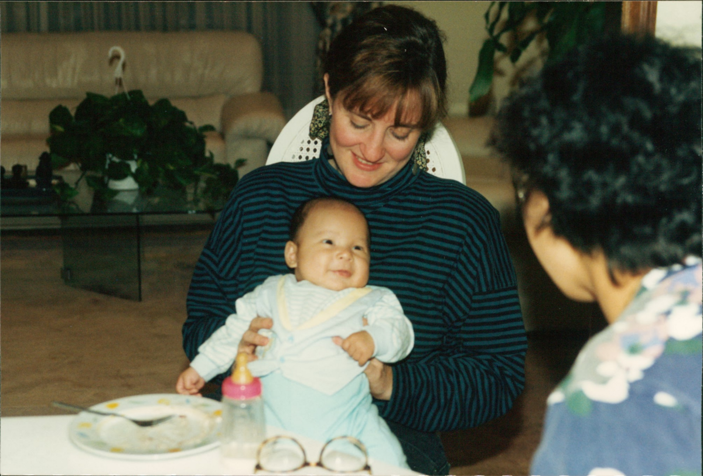
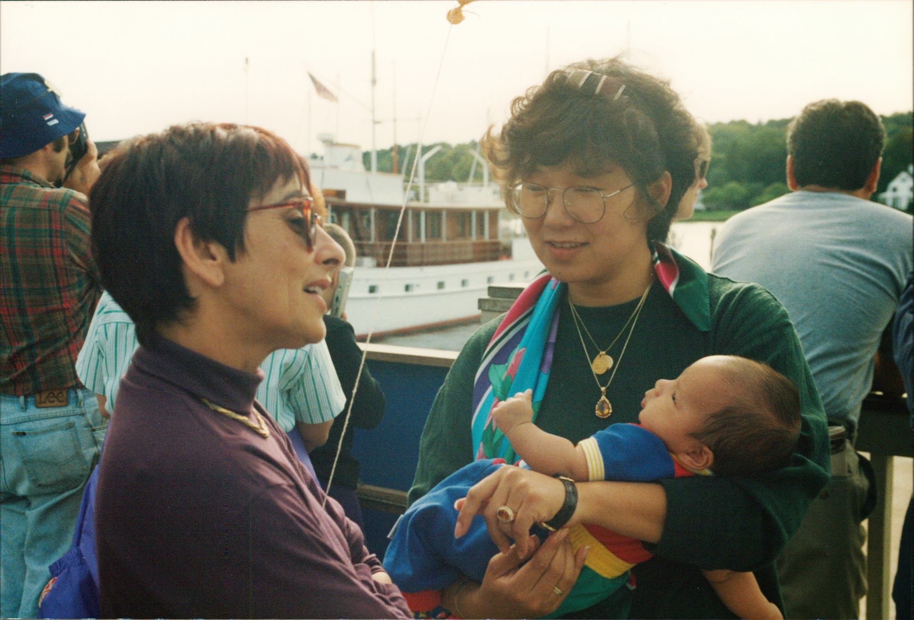
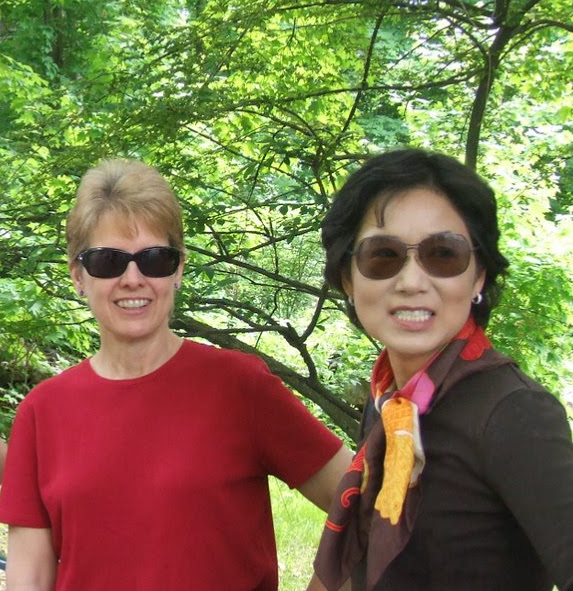
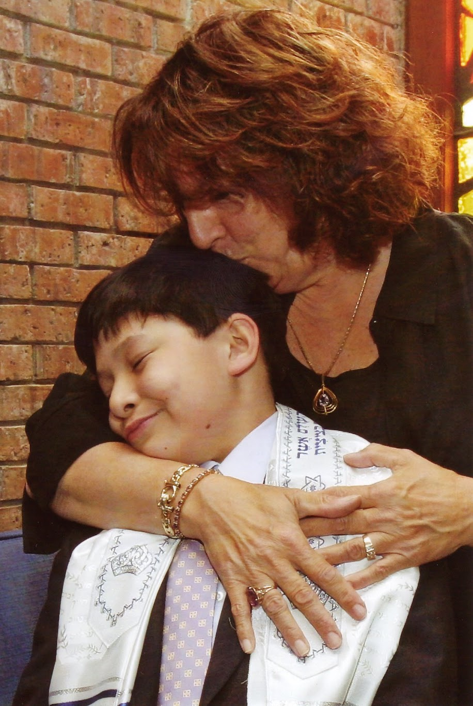

# Some news to share

*Wednesday, December 8, 2010*
&middot;
*email to friends*

Dear Mallary, Diane, Ditza, and Fran,

I have a bit of alarming news I need to share with you today. I will be having a major surgery on Monday, 12/13. I am diagnosed with cancer, but exactly what kind, they couldn’t tell for sure yet. However, everything points toward advanced ovarian cancer. The thing about ovarian cancer is, until they open you up, they don’t know for sure and how bad. However, given that pelvic biopsy confirms cancer and CT scan is showing things in the liver, it’s likely to be at least Stage III and more like stage IV (the most advanced stage).

It’s a bit of a shock, since I got the last general physical exam and yearly gynecological exam in April/2010. Everything was perfectly fine. It’s been only last couple of months that something was off, not because anything hurt: it’s just subtle indications and the sensations I have never had before. I went to see a primary care physician on 11/30, who was alarmed enough to send me to a gynecologist, who got further alarmed to immediately set up an appointment with a gynecologic oncologist. Meanwhile, various test results came back as described above. I went to see the oncologist on today. He immediately scheduled a surgery on the earliest available date. They will take out all the affected organs that they can do so safely, and try to pick out all the individual nodules they can possibly detect. I hear that this kind surgery can take up to 10 hours.

I am going in with the worst possible diagnosis in mind. If the actual diagnosis is better, then I will be elated. It’s actually oddly liberating to think of this as a stage IV. I feel like saying to this monster “I have seen the worst you can scare me with, and I am not afraid.” I am not scared at all. I am actually pretty calm. I have done research nonstop last few days. Yes, the published statistical odds are pretty grim (18% chance for 5 year survival for this stage of ovarian cancer), but I was told by the oncologist that the odds are more like 40% and even better, like 50–60% if indeed it’s not stage IV, but only stage III, so it’s already getting much better than I thought. I am confident that I can beat this. If anybody can beat it, it’s me. But as a realist, I will downwardly adjust my expected longevity by 10 years, from 100 to 90.

I am grateful that it’s me, not Amir and the kids, who will be going through something like this. It would be so much worse for me to watch them in a situation like this. Maybe, I am actually selfish in this regard. (Don’t worry, I am not indulging in self flagellation, just an observation). I am also grateful that this did not occur three years ago — I would hate to imagine Daniel’s last couple of years of carefree adolescent period and high school experience to be that of watching his mother go through this. I am also grateful that this did not happen two years ago — I would have not been able to help and guide Jonathan through the process of getting the ROTC scholarship and getting admitted to college. In fact, I realize that I have a lot to be grateful for: there are so many women who are in a position to fight this battle without the resources, support, and wherewithal that I have at my disposal. I truly feel profoundly grateful for the hands that I am dealt: even with this disease, I have been given a winning hand.

That said, I have an aching sense of sadness because of what it will do to my family: I suspect their pain and sadness will be much worse than mine — it’s always better to just fight it yourself than watch your loved ones fight. I would like to ask your favor. Please keep Amir in your thoughts and prayers. I feel the worse for him than for myself. He has been amazing to me through this and he will continue to be an amazing companion. I am so profoundly grateful for the fact that he is my partner and he will be there for me. I am worried that while he will devote himself to me, he won’t have much left to give to himself. He will need support and care from somewhere. I will be terrifically well cared for by him. There should be some comfort and care for him. I have already been telling him that he should not be consumed with the idea that he has to take care of me foremost. I told him this should not be his full time job. This will be a marathon for both of us, not a sprint. He needs to pace himself. He needs to take care of himself. So, any encouragement from you all for him to take care of himself and be kind to himself will be greatly appreciated.

Please don’t feel bad or sorry for me, because I will emerge as a survivor. I don’t want you to feel like you are walking on an eggshell around me. I am completely open to any discussion. I can give you a whole lecture on mortality rates of various stages of this disease (not that this will interest you, but you understand what I mean: don’t think you should constantly wonder what will make me feel uncomfortable and try to censor yourself). If you want to send me email, fine. If you want to talk to me over the phone, fine. Whatever. If I am not in a mood to engage, I will simply tell you (please don’t be offended).

However, please be aware that I have not told Daniel and Jonathan yet, because Daniel will be coming home this Saturday, and I would rather tell him in person with Jonathan. So, keep them out of the loop for a few days.

Some additional messages for each of you:

**Mallary:** In case you are wondering. Yes, when I went to your dinner event on Dec 4, I already suspected ovarian cancer based on all the symptoms and some preliminary lab reports, though the final test results were not out yet. I suspected stage III (I did not know about the liver part then). Thanks for including us in such a lovely evening event. I really enjoyed every minute. We should get together soon again with Hal and Ellie (after my surgery, between my chemo’s).

**Ditza:** Ha, I did one up on you. I think what I got trumps yours!!!!! But, seriously, your presence means so much for Amir. I am so grateful that you and Amir have each other. Amir will find such comfort in his close relationship with you and your family.

**Diane:** You have always been such a good friend to all of us. Please keep Amir in your prayers.

**Fran:** I am very grateful that Jon has your entire clan as a support network. He plays tough, but you and I both know what a sensitive softie he is inside. I am actually worried more about him than Daniel. I am so sorry that Jon’s last semester of high school will include watching his mother go through a grueling regimen of chemotherapy. The fact that you are in his life is such a source of relief for me. Thank you.

One thing though, Fran, if you are facebook friends with Jaewon or anyone in my Korean family, please do NOT post anything that they can read. I am not letting my Korean relatives know about this yet (long story, I will tell you later).

OK. This is it for now. I will let you know how things are progressing. By the way, I am not keeping any of this secret. You are free to share the news with other people who may know me — you can even share this email. There is no cure for ovarian cancer, and being a survivor means being able to contain it and manage it effectively throughout one’s life. This condition will now be part of my life repertoire, until such time somebody finally finds a cure. So, no point keeping it quiet. There are cases of ovarian cancer stage IV survivors who are still going after 20–30 years, living a normal life: I plan to set the world record on this.

You all have been wonderful friends to me. Thank you.

Hyeon

(PS. I found an amazing support group forum on the web, and this has already been tremendous source of information and encouragement. There is one thread I started as below: stupid things people say about deadly diseases. I am “evertheoptimist” (my screen name). Read it: it’s really hilarious. When you have a chance, tell me your favorite. Mine is “Oh well, at least you know what the future holds for you!”
