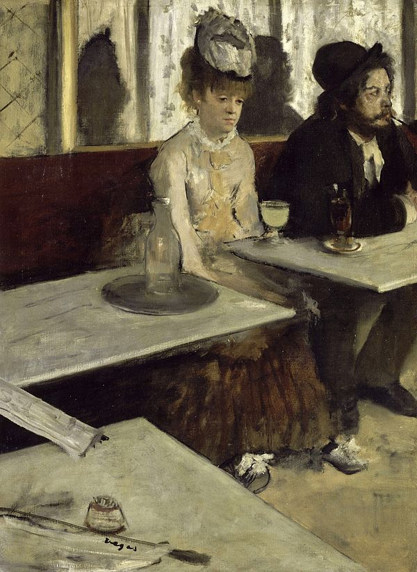
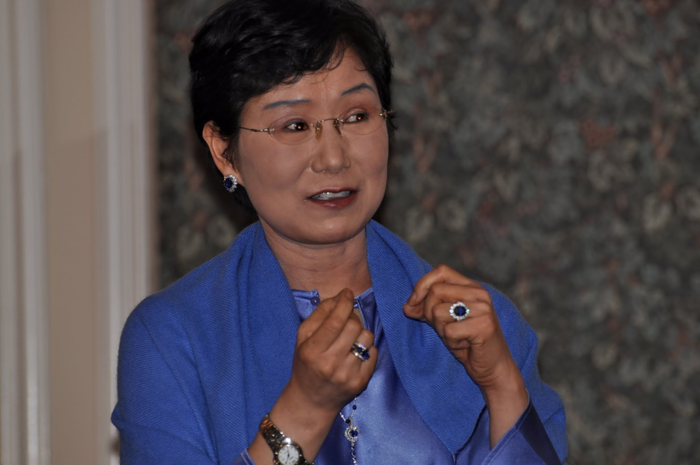
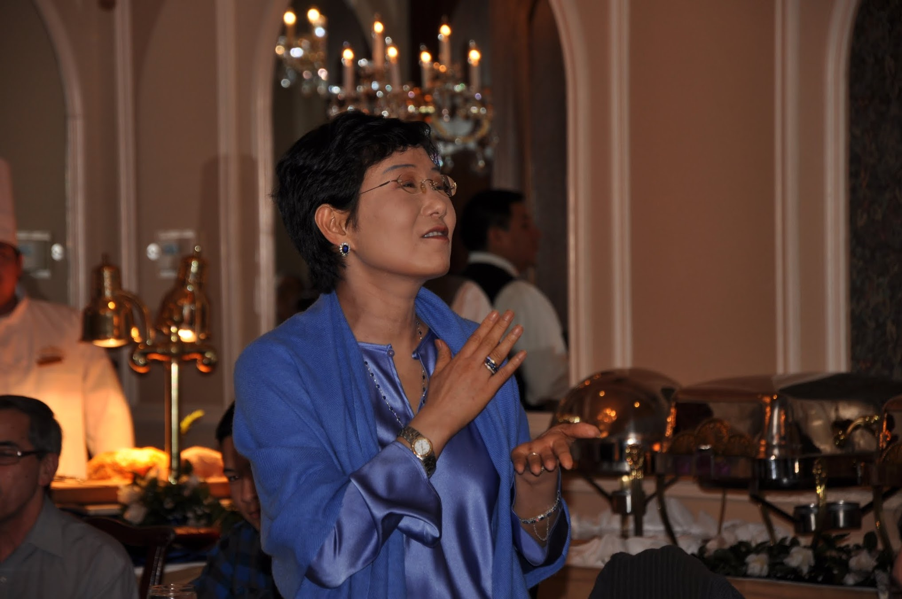
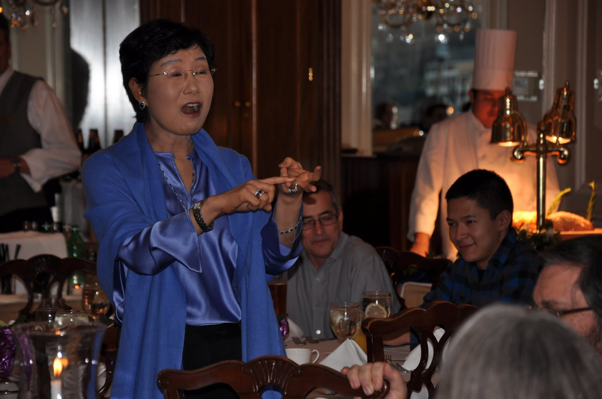
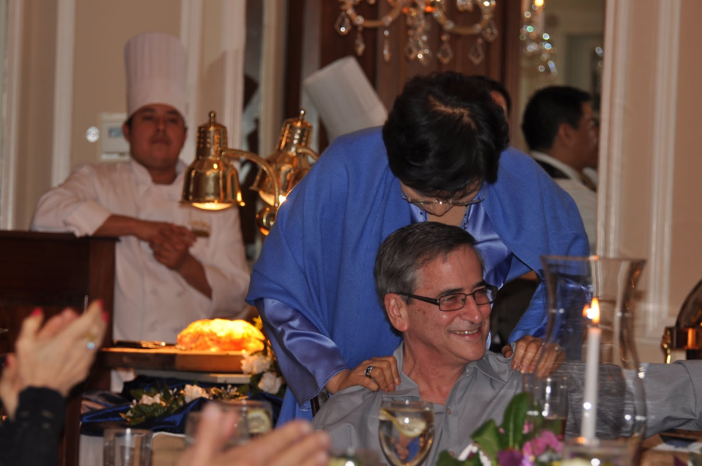
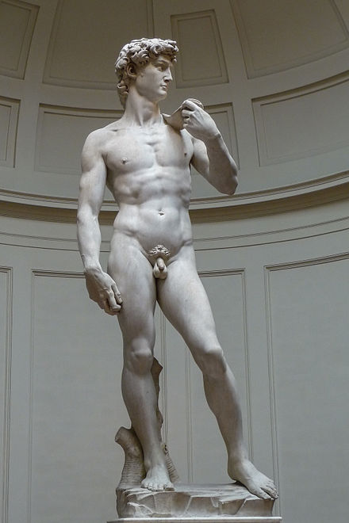

# The Absinthe Drinker And David

*Sunday, March 4, 2012*
&middot;
*essay*

Musee d’Orsay in Paris is one of my three favorite museums in the world — the other two being Metropolitan Museum of Art in Manhattan, and Rijksmuseum in Amsterdam. I remember our family vacation some years back — a whirlwind two week affair from France to Holland with Belgium in between. In Paris we made an obligatory pilgrimage to her world famous museums. When you are exposed to so many masterpieces in a short period of time, the art overwhelms you. You don’t really remember individual pieces and everything becomes a blur after a day or two. Yet, one piece of painting stood out. I have seen this painting in countless art books, and I even saw it in my previous visit to Musee d’Orsay. Yet, somehow that day, it called out to me and drew me in.

It was Degas’ Absinthe Drinker. I stood there, transfixed. It shows a woman staring downward at a glass of Absinthe. Absinthe was allegedly a very popular drink — a powerfully addictive concoction favored by artists and other not so desirable non-conformists of the time. I have never seen a painting or a photograph that captured the sense of quiet resignation and a wordless despair quite like this. Not the divine sorrow that elevates both the original subject and the viewers eons later that Michelangelo’s Pieta evokes. Not the wordless wail of pain and horror in Munch’s paintings. But deeply set melancholy that one can’t scrub away. Some might say that the Absinthe Drinker’s despair is repulsive in its willful failure to extract even an ounce of pity from us by refusing to distill the sadness into something more noble or worthy of our sympathy — something that transcends the vulgarity of the situation depicted: a woman of ill repute about to embark on yet another binge cycle, not out of excitement and anticipation, but out of a lack of choice to do otherwise. I was drawn to this woman who made me feel like a cripple. There was this whole swath or emotional landscape that I have never experienced in my life. I felt incomplete — emotionally. I wail. I holler. I scream. I don’t sit in a quiet despair. She was giving me a glimpse of a foreign landscape. I was morbidly fascinated with and alternately repulsed by her.

Little did I know years back then that one day I would actually know in my heart what that woman must have felt had she been a real person. Last week, sitting in the waiting room at the Memorial Sloan Kettering Cancer Center, I felt like that Absinthe Drinker. How apt is it that I was actually about to “drink”, through an IV, a toxic cocktail that my body cannot live without? How is it different from the addictive narcotic the woman in the painting feels she has no choice but to imbibe? I am usually the most upbeat patient in the whole center. I come in with a bounce in my gait and dispense cheery greetings to the staff peppered with a good-natured tease. But that day, I sat there with a foreboding sense of impending doom and an ever increasing sense of futility of it all, waiting for my turn to be called into the pen where I would get hooked to the IV bag full of poison. For all I know, I was getting the chemo infusion that may not even be working anymore.

Lately, my cancer blood tests results have not been good. Though a scan taken mid way two months ago was clean, the cancer antigen number has been slowly, but consistently rising and it seems to accelerate now. Though there is a chance the number is going up for reasons unrelated to cancer, the more likely scenario is, the drug that worked at the beginning stopped working now, and cancer is coming back again. I have seen this movie before many times, watching other women go through this, and so far, a happy ending is rare. We will have to get a scan to see what’s going on, and devise a plan for the next step. Given that my cancer meter has been really quiet, I am hoping if anything is showing on the scan, it’s just a really early stage. If it’s wide spread, I can no longer rely on my cancer meter to get an early warning on what is happening. That would be an alarming development.

So, there, I sat like the Absinthe Drinker, already dreading the results of the scan that has not been even taken yet. No matter how prepared I think I am for bad results, a part of me is already asking — how many times should I buoy myself only to fall hard? How many times should I pick myself up off the floor to charge forward only to hit the wall instead? The other day, a friend of mine said she admired me for my courage and determination. I felt like she was describing someone else that I did not even recognize, because that was not how I felt. I felt like the Absinthe Drinker. While she might be worthy of pity, she certainly did not look like a hero to me.

My self introspection and a nascent journey to “complete” my emotional repertoire did not last long as I had to put a final touch on Amir’s surprise birthday party that was to take place in a few days. I planned this six months ago, just before my recurrence was confirmed. It was meant to be a complete shock to him, since this is about the last thing he would ever suspect me of doing. I have always sneered at the oh-so conventional American middle class bourgeoisie ritual of a surprise birthday party. How sophomoric, I used to say. I even have it in writing that if he ever pulls off anything like that on me, it will be a ground for divorce. Hence, the foundation for a successful surprise party was there. I needed to execute well though to make it a real success. I meticulously created a guest list consisting of all the shady characters plucked out of the far flung alternate universe called his ignominious past with the help of various people who got to know him at different points of their shared past. Amir’s sister and her husband flew in from Israel. Friends from his graduate school days flew in and drove from Illinois. Friends from near and far came. All of them completely cooperated and did a magnificent job keeping this a secret for 6 months.

This was not an easy stunt for me. First of all, I don’t do events. In fact, I am allergic to ceremonies and such. I couldn’t even stomach the idea of my own wedding event so we got married in a court house. My two kids have a standing offer of an elopement bonus from me. The worse problem is the fact that we are the type of couple who share everything and anything. For me to keep this kind of a monumental secret from him was not an easy feat. I even had to orchestrate a decoy birthday event with only a very small group of friends, so that he wouldn’t sulk in the corner.

It was so worth everything though. I will never forget the look on his face when he walked into the banquet hall: he thought we were attending a wine tasting event held at a local hotel. The party was a magnificent success. Food was superb, the setting elegant, and the staff courteous and efficient. More than anything else, it was the guests that really bespoke the kind of person Amir is and made it such a meaningful and moving occasion for him. People genuinely loved and appreciated Amir and it showed. I could feel the warmth the guests felt even just among themselves. There was such good cheer all around. I asked the guests to come up and share quintessential Amir Mané stories. I shared mine, and several guests did too. The most touching was what our two kids shared. One of them concluded his remarks by saying “you all are very fortunate to have him as a friend. As for me, having him as a father was like winning a lottery.” Amir is one lucky dude. People were saying things about him they would normally say when the object of their exaggerated and revisionist platitude is lying in a casket at his funeral.

In the end, the joke was on me, because I was very pleasantly surprised: the party was much more a success than I ever imagined or planned it to be. All I wanted was to pleasantly surprise him, and

In the end, the joke was on me, because I was very pleasantly surprised: the party was much more a success than I ever imagined or planned it to be. All I wanted was to pleasantly surprise him, and see him amused. Last 16 months were not easy on him either: I believe it’s much worse to watch a loved one go through what I had to go through, than do it oneself. I just wanted to give something back to him. I must also admit, I wanted to create an occasion for my kids to see their dad through my eyes — there might not be enough time for me to tell them in so many words. Another motivation for the party was, if I don’t emerge as a lucky survivor, I want my family to remember the time of my struggle as a happy time in our life together — the springtime when all the beautiful things blossomed, not the emotionally barren landscape of bitter cold winter. An evening like this is what I want to leave behind.... This is what I want them to carry forward with them. In short, my ambition was relatively contained and modest. Yet, what I saw was beyond anything I expected to get out of this event. I have never seen Amir so happy. He said, “This was the happiest moment in his life, and it was a transformative experience. I never want another party for me, because nothing is going to be better than this!” Guests did not want to leave even when it was well past the allotted time in the banquet hall. I was reminded of the Danish movie Babette’s Feast. If I were to capture one perfect moment in life, that evening of the party would be it.

I have been willfully deluding myself into thinking that the cancer, as a whole, is a net positive event, a gift. I wanted to believe this so that I can create a convincing façade of hope and optimism to what could be an unmitigated catastrophe. That evening, I felt that maybe I was not deluding myself after all. Without my cancer, it would not have occurred to me to throw this party for him. Without cancer, I would not have had such a keen sense of appreciation for the love we shared. Without cancer, I would not have made such a deep connection with some of our mutual friends in that banquet hall. Cancer made my outer shell porous. Though I am still obstinate and stubborn, I am more open to letting people in and reaching out farther. That evening, it almost felt like a tendril of billowing smoke that used to dull the colors and obscured the shapes of all that surrounded me was clearing away. A haze that hid the distant beauty on the horizon was lifting, and I could see far away..... I could almost discern each individual wavelength that made up the vibrant colors I saw. I could almost hear individual note of all the sounds I was hearing — the laughter, the song, the whisper, and the cheery melody of wine glasses clinking....

But this gift comes wrapped in a thorny ribbon. There is an abysmal darkness to this gift. And, yet, this darkness is a shadow paired off with light. I remember another glorious museum trip in Florence — to the venerable Uffizi. No matter how many times you saw the photograph or a replica of Michelangelo’s David, you are never prepared for the visceral, emotional impact of being there in David’s presence. All other objects and creatures diminish in scale. He alone is alive. I remember that visit so long ago. I remember the interplay of light and shadow that together gave David his presence. I remember the shadow that defined his gorgeous contour. It imbued him with a soundless voice that speaks to the viewers across the chasm of time and space. Imagine — no shadow, no David. I know now the darkness as part of the harmony of light and shadow can be a beautiful thing as it gives shape to beauty that would remain shapeless otherwise. I understand now the Absinthe Drinker is David’s shadow. I must remember to embrace both of them, for one does not exist in its full glory without the other.

I feel blessed that, so far, my cancer did not extinguish the life force of this family. It did not become the darkness that snuffed out any trace of light in the room. Rather, it became that shadow that gives the elegant nuance to the contour of the beautiful sculpture we managed to chisel out of a block of marble during last 27 years of our life together — my little David. My primary goal is not necessarily a long term survival (though I will do my best to achieve it), but to leave the legacy that fits the essence of who I am. A little miniature David with a perfect harmony of light and shadow. This is the legacy I want to leave behind. So far, I am succeeding.

I hope to take my kids this summer to Florence. To introduce them to my David. To show them the light and shadow of Tuscan sunset. I will not leave the Absinthe Drinker home. She is part of me. She gives David his glorious contour.
