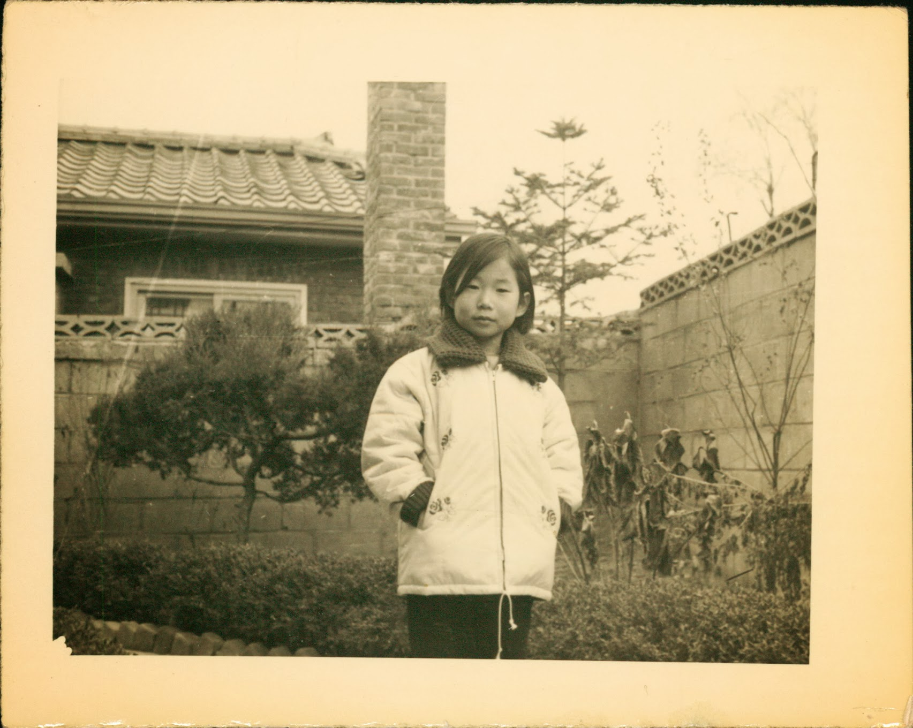

# The Curley Red Haired Inner Demon

*Tuesday, September 20, 2011*

Day 1 of the new round

I am going to take a break for one day from this “I am so grateful even with this disease since I have so much going for me bull@#$%” and let my curly red haired inner demon finally have a day in court (no, I do not have a curly red hair, but in my mental image, a demon was never a creature with horns and a pitch fork, but rather an uncontrollable girl with a satanic temper with flailing curly red hair).

Yesterday was non-stop frustrating.

First, I did not sleep well the night before. A lot on my mind, ya know? I left home around 8:10 AM. I missed a train from NJ to NYC by a minute. (there was a traffic accident on the way). Huffing and puffing, I barely made it to platform while the train was still there, but the door was closed and it wouldn’t open. This is the first time ever I missed a train or a plane. So, I sat at the platform for close to an hour already in a sour mood. So, I was late to my appointment by 45 minutes. Had to wait for an hour to see a doctor. OK. Since I was late, I can’t complain. Though, I must say, even when I was right on time or even early, they had the track record of making me wait well over an hour so I wonder if it would have been same any way.

To make it worse, Lo, it’s not that handsome Dr. Sabatini but one of his minions. OK, I was forewarned here because he is not around on Mondays. He is an eye candy. Last time when I was there, I told him you know, you have groupies among us. And, unlike 18 year old air-headed bimbos going for a rock star, your groupies are mature, thoughtful, sophisticated, and intelligent. He blushed for a minute but had a presence of mind to collect his wits and say “and, modest too.” Don’t worry. It was a consultation meeting and my husband was there too. So, don’t tell me that I am hatching any immodest plan behind my darling husbands back. Besides, I am faithful to my first love, Dr. S in NJ who diagnosed me, operated on me, and saw me through the initial treatment phase.

Anyway, I digress. The doctor examines me, and she has a chaperon with her (when her assistant was about to leave, she clearly indicates you are my chaperon, I want you here). I wonder whether she thought I was going to pounce on her: you know, with a curtain drawn, and only about 1,000 people milling around, you never know what impure designs some of the predatory cancer patients may have on you. Of course, I know the real reason. We live in a world of founded and unfounded lawsuits of all kind, frivolous or not, so she has to be cautious when her job includes examining women very privately. She asks me where my chemo port was. I tell her that it had to be taken out 10 days after my last infusion since it got infected. She says Doxil is particularly toxic to veins maybe we should insert another port into you. I am now panicking. I hated that port. I am thin and bony so it sticks out a mile high around my collar bone and SO obvious. She texts Dr. Sabatini, and he says perhaps not necessary unless I starts to react badly around the vein (pain, rash, etc). First good news of the day.

Now, I am sent back out to the waiting room. I know that after chemo infusion, they will have to jail me for 4 hours to draw research blood a couple of times, so I am doing reverse engineering. Surely, they do NOT want to hang around well into the evening, so just for their sake, they are going to make sure I am not there beyond 6 PM tops. Two hours pass. I get nervous. So, I ask the front desk receptionist how late they open. She say 10 PM. My heart sinks!

After these two hours, they call me in for a blood test: they say, the lab has been busy. Another 2.5 hour pass before I am finally called in for a chemo infusion. There, they explain the reason why everything was delayed: the last weeks blood test showed something that they did not like, and they wanted to retest me. The blood results take at least an hour to come back, and it takes another 1.5 hour to prepare the chemo drugs once it is deemed “go.” Now I am going back to the elementary operations research principles I learned while at Wharton, and thinking, you guys knew about this a whole week. You could have drawn the blood the moment I arrived. Now I am silently fuming. I take back all the things I said about MBA program being useless. I finally see the real life application of that education because it allowed me to have a theory based, empirically validated annoyance.

The chemo infusion starts. Takes an hour. It’s 5: 40 PM now. I know I will have to there till 9:40 because of the research blood collection requirement. Shortly after 7 PM, my husband shows up with food. He works in NYC. No, he is not a heartless cad who wouldn’t accompany his sick wife to a chemo suite. It’s my wish. I told him multiple times that there is NO reason why two people have to be punished when one suffices, and he should go home early since unlike me, he has to track back to NYC the morning after. Nevertheless, he shows up, and I am glad. But I still thinks that him showing up was a net negative on the collective sunriseeast & hubby dyad happiness index. The amount of gladness I had is far outweighed by the unnecessary aggravation on his part. Well, anyway, part of me is glad that he is not so good at optimizing everything on a rational basis.

I am finally out close to 10 PM. By the time I came home, it was close to midnight with the train schedule and what not. So, it turned out to be a 16 hour day. They should mandate a certification process for an advanced cancer patient status. Those who fail will be assigned to less glamorous garden variety ailments like high blood pressure and indigestion.

Today, I am off. Tomorrow, I go back. This time, I am getting their experimental drug shot. The appointment is 10 AM. I know for sure by now, that I won’t get the shot until earliest noon, and then they have a schedule for drawing my blood 4 times for the duration of 8 hours for the research purpose. I am glad that I will be contributing to the advancement of science, though, I must confess that’s not my primary motive: I am doing it mostly for myself since it gives me the best option going forward.

PS. Going back to the regular programming of gracious me, I am SO GLAD that I am getting this Doxil treatment. I can really feel exactly where my tumors are located. I have a particular sensation in several locations in my abdominal/pelvic area and when I went back to the scan report, lo and behold, they talk about these areas. I am by now an incredibly honed machine in reading the signs of my body. When I had my first chemo, I knew within 2–3 weeks that the chemo was working since the sensations were much weaker than before. I sensed this recurrence well before any tests or scans and just only about 10 days AFTER the clean tests results. This time, I will know within a month top whether this second of chemo is working or not. It’s a very unnerving feeling that you feel your tumors growing day by day. It freaks me out. So, yes, I am incredibly grateful that I was offered this trial that comes with the drug currently nowhere to be had in USA.
