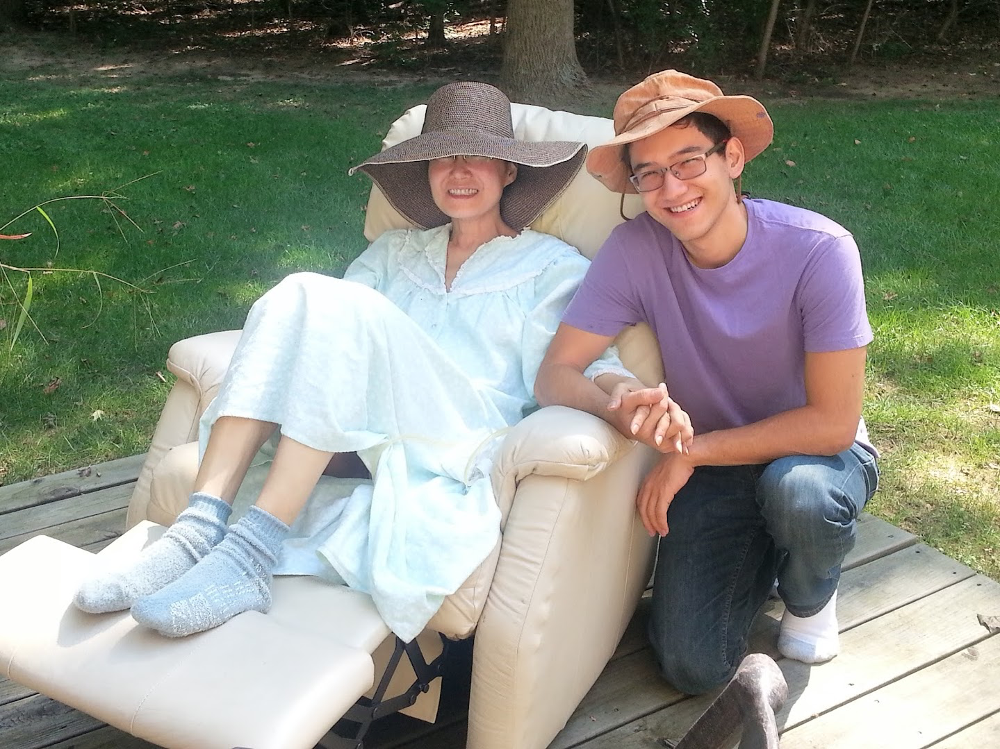
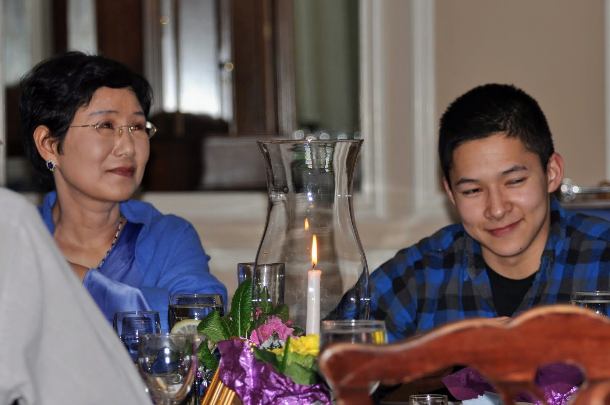

# The Intangibles That The Glory Of Life Is Made Of

*Thursday, March 22, 2012*

Today was a beautiful day! A fit day for me to regain my posture. I feel silly and sheepish for being morose last few days. Usually, it takes only a couple of days for me to recover from whatever funk I am dealing with. But this time, it took longer — I guess I have been on an alert for last several weeks, and it just took a bit longer than usual.

In spite of everything, I am so blessed, while so many people with my condition are struggling under difficult circumstances. I always think about this…. I should count my blessings.

Dan, on a spring break from the University of Chicago, has been like an ointment on a wounded soul. He volunteered to come with me to MSKCC on Monday when I was getting a scan, and again on Wednesday for a consult with my doctor. What a sweet, sweet kid! He held my hand. Hugged me. Told me that he couldn’t believe his luck for having such wonderful parents. He is telling me all the things people don’t expect to hear from their offspring unless they are lying on a casket at their funeral. I will never forget that goofy grin on his face when he surprised me by showing up at the doorstep with a bouquet of flowers the day before last thanksgiving, when he was supposed to be visiting his friend’s family in Kentucky.

I ended up taking him to a nice restaurant after the consult with my doc (Amir also joined, but he had to get back to the office). Cost me more than I expected, but you see, as an older woman having a date with a good looking young man, you are expected to pay through the nose :) This is a kid in whom piercing intellect, wisdom, kindness, ambition, and maturity miraculously coexist in perfect harmony.

Jon is less demonstrative, but during Amir’s party, when Amir gave a speech and mentioned me to tell everybody how much he appreciate our life together, Jon held my hand the whole time in one hand and the other arm draped over my shoulder. I know what this means. He feels much more deeply than he appears. I also know he is much more scared about my condition than anybody in the family. He invited us to an award banquet in his college in April. I am looking forward to it. There is a benefit of having him in a driveable distance.

Unlike girls of my generation where I grew up, I never considered my life mission to be a good mother to perfect children. Somehow, I managed to have what all my peers were indoctrinated to wish for over anything else in life. I feel very sheepish about this whole thing — somewhat undeserved really, since I did not ask for it, and certainly, I did not pay a hefty sum for it…..

So, regardless of what happens next week, I must remember these are intangibles that the glory of life is made of, not my blood test numbers or a poisonous drink of the chemo cocktails. So, next week I march again with whatever concoction they come up with. This weekend, I will enjoy an unexpected gift of the early spring.
