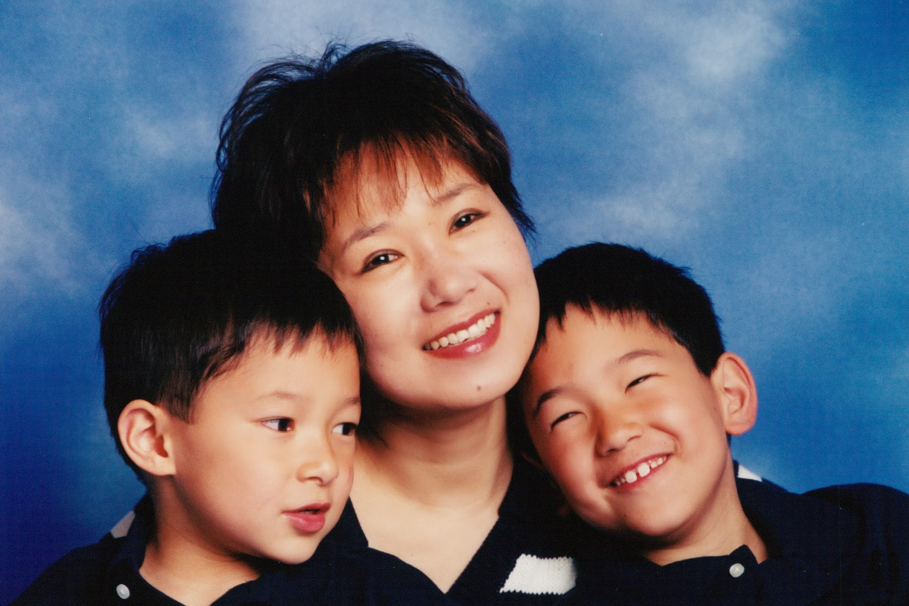

# Why I Write

sunriseeast — 01–21–2012 10:51 AM

lilmom,

your memory of your mother brought tears to my eyes.

One of the major drivers for me to start writing is my children. if I succumb before I have a chance to have an adult to adult conversations with them, I want them to have something of me that is not just their mother telling them to wash their hands, to go to bed, and say thank yous and excuse mes. I wanted them to know me as a person who existed before them and lived a life with a three dimensional view of the world in addition to being their mother. More than anything, I wanted them to know the inner me.

My kids are reading all this now, and have gotten to know me as a full bodied figure, not some abstract — prematurely! This really brought them closer to me. I have a lot to be thankful for.

